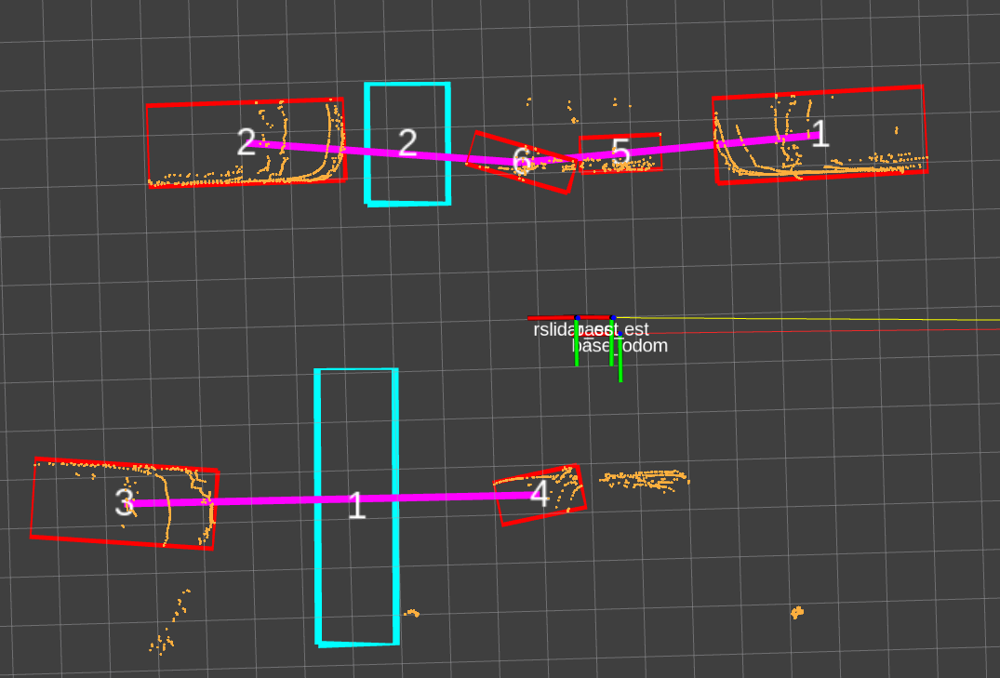
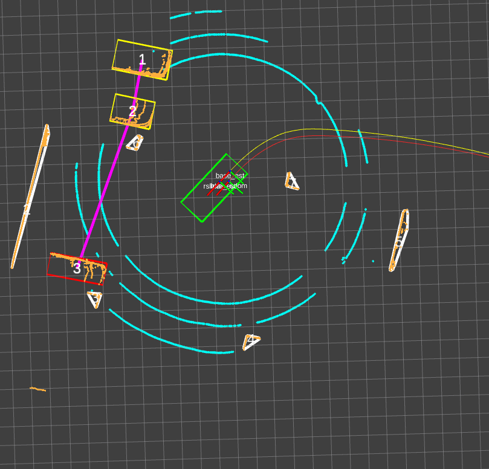

# 第三周

## 2020-12-18

大论文写完了，3天打鱼两天晒网那种方式磨叽完了，实车实验部分还没有做，先这样拿去抽盲吧，抽不中就慢慢做是测试样，抽中就可能延毕，一场豪赌。

论文质量我是不敢苟同的，实话说，实验的效果我也是没有底的。现在的心情和当年本科毕设一样难过，感觉自己是写了一坨又臭又长的shit。

为了给自己的学术生涯画上一个比较圆的句号，让自己进入社会之后更有底气和自信一些的话，我必须后面3个月里把实验做好，把自己想要实现的原理实现。同时巩固之前欠下的知识。

1. 库位搜寻实现本周
2. 库位检测实现一周
3. 库位跟踪实现一周

# 第四周

本周任务：

1. ~~搜寻库位实验~~

2. 三个雷达数据同时接受并标定

## 2020-12-21

> 又颓废了一个周末，啥也没干。早上一定要起来啊，不要等着手机没电了才起来。就算只有一小时也能干很多事。

1. 库位搜寻调试:
   - ~~寻找库位的矩形表征，写求解成员函数~~。

## 2020-12-23

> 昨天开例会又没能走出寝室，今天我要证明在寝室也能好好学习。必须紧张起来了，想想昨晚不能入眠的原因。

1. 库位搜寻：
   - 整合到detection节点中调试运行。**发现MST可能不适用有立柱的情况，不固定矩形框比例不能适用。**

## 2020-12-25

> 昨天又没有走出寝室，走出舒适区，养成学习常态，迎接社会的打磨。

今天的目标是：

1. 适配新的矩形库位推导方式。


为什么修改后出现这个问题？1，删除了固定障碍物比例的句子  2，修改了分类为vehicle型的rule，加入立柱的判断依据。

--> MST分组失败；发现BBox角度定义的理解错误


## 2020-12-26

> 这个星期又过了，今天又没能早起，至少现在开始努力解决一个一个的问题

今天的任务是：

1. ~~解决bbox的定义匹配问题~~
2. 实现矩形表征库位的输出
3. 改善搜寻库位的算法效果

### **问题记录**

- 编译后还是运行之前的版本。拟解决：cmakeType Debug。重启几次
- 除法“70/180*M_PI” 默认 **整数除法**，注意小数精度，拟解决：“70.0f/180.0f *M_PI”
- **一般式直线方程**： $cos\alpha x +sin\alpha y+ p =0 $ 中指的是直线法向量的角度，与直线方向向量垂直。

## 2020-12-27

> 昨天遇到好多新的问题，莫名其妙的问题。看来还需要下很多功夫的，不能吊儿郎当的，必须认真。

今天的任务是：

1. ~~输出myrect表征库位~~
2. 改善效果

**调试No1:**

```shell
$ case2(delta_angle=180):A,B,theta_PS  88,92.6667,-89.6667

$ filter_by_size: 0 width: 2.31299 deep: 9.56939
```

theta_PS是对的，库位尺寸depp为什么这么大不可能呀？

- **定比分点公式是不是用错了**，参考链接：https://zhuanlan.zhihu.com/p/26374239
- 采用一般式直线方程求解投影点坐标更简单

**调试NO2**：

```shell
case0(half),A,B,theta_PS: 176,176,-4
filter_by_size: 1 width: 4.1423 deep: 6.95453	#看起来正常
```

```shell
case1(delta_angle=90):A,B,theta_PS  1.66667,86.3333,-1	#有问题，应考虑库位类型
```

- case1中出现这种情况，是由于只看见了某一辆车的车头，其拟合框的车宽大于车身的长度，此时以长边为准的角度会差90度，应该旋转修正面积小的矩形的朝向。

**调试No3：**

<div align=left> 

程序中给的角度是库位中线的角度，不等于BBox的角度。通过比较width和deep的长度分别给BBox构造函数初始化

### **问题总结：**

- <div align=left>

  地下车库的**立柱**被识别成障碍物让库位被分类为占据

- **abs和fabs问题**，abs给float型求值有时候为0，得用fabs
- **vector问题**，当初始化时给出大小为4，后续用push_back()会在末尾添加，容器大小变为5，前几项仍为初始值0.
- 求库位中线向量的时候用方向向量的加法可能会比较方便，*未实现，有时间可以尝试*
- BBox的构造函数要弄清楚

# 第五周

> 上一周在周末的努力下算是勉强调通了搜寻阶段的实验，事实证明任何事情只要迈出第一步其实也没有那么难的。三天打鱼两天晒网的工作状态实在不好，必须将学习常态化，融入自己的热爱生活的理念中去，不断进步。这周是2020年的最后一周的，希望给它画上一个圆圆的句号。

本周的主要任务是：

1. 检测算法的输入接口：三个雷达的数据，目标库位的锁定
2. 检测算法的调通
3. 多雷达标定的改良

## 2020-12-28

> 昨天最后时刻调通了，勉勉强强算是完成了任务。今天修葺一下之后，开始攻克检测算法吧！

今天的任务是：

- ~~修葺归档，搜寻算法~~
- 开启检测算法的整理

### 问题记录

今日全场最佳耗时问题：

```C++
float angle_AB = fabs(coefficient_line_AB[1]) < 1e-6 ? M_PI_2 : atan(-coefficient_line_AB[0]/coefficient_line_AB[1]);
```

在讨论分母不等于0时，没有加绝对值，浪费好多时间照这个问题。

> 头疼欲裂开

## 2020-12-29

> 今天很早就被吵醒了，睡不着，跑去看了部电影：心灵奇旅，好看，打算二刷。现在收心回来好好学习吧。

今天的任务是：

1. 整理编译检测阶段的算法

