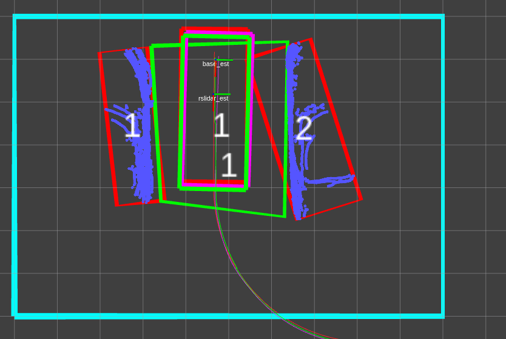

# 第一周

## 2021-01-02

> 新的一年了，元旦借感冒之由，在寝室休息看了几部电影，新的一年要更加努力。

今天的任务是：

1. 总结梳理一下新的消息格式和数据包
2. 周年回顾
3. 看看书

> 今天刚坐下，就和chen去实车上了，他验证了一下修改GPS的可信度的效果是否提高，我拆了一些新的泊车的感知数据。本以为感冒已经好了，但是在车上这段时间真的越发恼火了，晕得厉害，像是晕车了一般。回寝室躺了看电影，买了点药快递过来还挺快。看了几部电影，寻梦环游记，remember~ me~ ，沐浴之王，，曼达洛人。都还挺好看。

## 2021-01-03

> 这周真结束了，有啥进展？没啥进展，被感冒和跨年耽搁了。为了毕业，后面一分一秒都不能耽搁了。认真的态度必须培养起来。

今天的任务是：

1. ~~周年回顾~~
2. ~~看看书~~
3. 总结梳理一下年末讨论的代码。

> 现在是晚上七点, 看看书,结果看得有点多了.自控力，娱乐至死，牛奶可乐经济，图解算法都看了一章，开始努力毕业吧。一晚上也没调试完收发点云的节点，效率有点慢啊！

# 第二周

这周的任务是:

1. 把实验思路和代码调通

## 2021-01-04

>新的一周开启,这周必须抓得更紧了,必须全神贯注,不能不紧不慢的干活了.

今天的任务是:

1. ~~收发点云节点调试~~
2. 卡尔曼滤波器类整理

> 遇到有点棘手的问题,是dsdyaw的频率问题我应该怎么解决呢?

## 2021-01-05

> 今天好烦啊, 又没能出寝室成功,水淹着鼻子了. 必须抓紧任何时间了.

今天的任务是:

1. 看看代码其他的任务.

2. 做个规划:

   2月3日离开, 1月28日查重, 

   1月25日前文章写完

   1月18日整理实验数据，写文章

   1月11日实验

   1月11日前代码调通

## 2021-01-06

> 昨天等于啥也没干。今后必须泡在实验室了，赶紧毕业滚人。

今天的任务是：

1. 调通KF库位检测阶段
2. 调整矩形拟合的参数

> 调试遇到的问题真多，不要慌一个一个解决吧，明天继续。

## 2021-01-07

>还有很长的路要走,集中注意力,加强锻炼专注.

今天的任务是：

1. 调通卡尔曼滤波器
2. ~~调整拟合算法参数~~

### debug:

todo：

- 检测拟合框歪了45°?why?
  - 0~pi/2, dist =0.02  ---->>>>效果好了很多ok
  - divide into 2 parts 而不是4部分，由于点云先被转换到map坐标系下，因此通过讨论原点和点云的关系寻找可视边的逻辑不合理，修正到通过每边点的数量来讨论。简化了好了
  - 在只看见一条边时容易歪：
  
  
  
  ​		新写的实现代码，突然解决。
  
- 第二次拟合删除点一直为0

- 卡尔曼滤波器输出nan

- 关联目标库位

- 发布tf_slot_map

## 2021-01-08

> 日子过得好快，昨天的代码也有很多没调通。希望这周能把检测阶段的算法调试好。

今天的任务是：

1. 调通第二次拟合的算法
2. 调通卡尔曼跟踪的实现

### debug：

- **关联目标库位**:

  roi中可能不只有两个障碍物，应快速匹配产生目标位的两个车。

- **第二次拟合删除点一直为0**

> 今天有结束了，不知道为啥我一直卡在讨论库位4个角点排序入口点的地方，这里明明不是很难。我真正想要做的是想把四个点的排序简化到两个有向点的讨论，并且将工况一般化，但是建立两个有向点其实也要进行排序。所以我不必纠结呀，先实现功能再说，每次写一个函数先明确目的，要干什么？输出什么？输入是什么？再集中精力去解决，相信一定能快速搞定。这次就是写着写着忘记了我的目的只是匹配出目标库位。明天加油吧，时间不多了。

/swapfile                                 none            swap    sw              0       0

## 2021-01-09

> 已经周六了,昨天也没做什么,倒是熟悉了一下代码2333,今天全神贯注

今天的任务是:

1. ~~关联目标库位
2. 第二次拟合算法
3. 卡尔曼滤波

### 问题记录

- 全部转换到map坐标系会有问题，我的定位结果如何与rt3000比较？必须在库位坐标系下比较，默认了一个坐标变换

- 坐标变换还有问题,将自车位置转换到库位坐标系时不能使用原点了.必须把车辆原点在map坐标系下的坐标输入