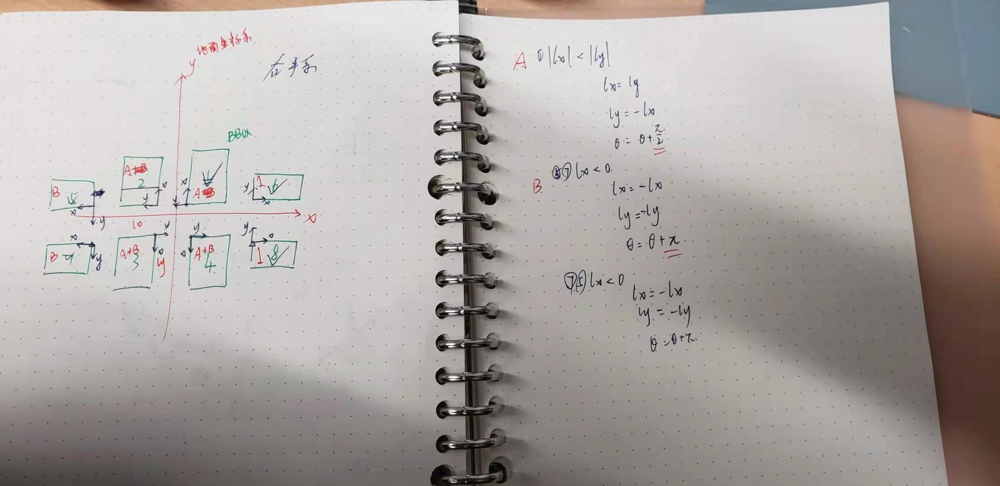

title: 202101备忘录
date: 2021-01-03 19:28:42
categories:
- 研究生
tags:
- 备忘录

top: 101
photos: /images/cat4.webp
description: 每天晚上写下自己明天要做的事，安心睡觉吧！

# 第一周

## 2021-01-02

> 新的一年了，元旦借感冒之由，在寝室休息看了几部电影，新的一年要更加努力。

今天的任务是：

1. 总结梳理一下新的消息格式和数据包
2. 周年回顾
3. 看看书

> 今天刚坐下，就和chen去实车上了，他验证了一下修改GPS的可信度的效果是否提高，我拆了一些新的泊车的感知数据。本以为感冒已经好了，但是在车上这段时间真的越发恼火了，晕得厉害，像是晕车了一般。回寝室躺了看电影，买了点药快递过来还挺快。看了几部电影，寻梦环游记，remember~ me~ ，沐浴之王，，曼达洛人。都还挺好看。

## 2021-01-03

> 这周真结束了，有啥进展？没啥进展，被感冒和跨年耽搁了。为了毕业，后面一分一秒都不能耽搁了。认真的态度必须培养起来。

今天的任务是：

1. ~~周年回顾~~
2. ~~看看书~~
3. 总结梳理一下年末讨论的代码。

> 现在是晚上七点, 看看书,结果看得有点多了.自控力，娱乐至死，牛奶可乐经济，图解算法都看了一章，开始努力毕业吧。一晚上也没调试完收发点云的节点，效率有点慢啊！

# 第二周

这周的任务是:

1. 把实验思路和代码调通

## 2021-01-04

>新的一周开启,这周必须抓得更紧了,必须全神贯注,不能不紧不慢的干活了.

今天的任务是:

1. ~~收发点云节点调试~~
2. 卡尔曼滤波器类整理

> 遇到有点棘手的问题,是dsdyaw的频率问题我应该怎么解决呢?

## 2021-01-05

> 今天好烦啊, 又没能出寝室成功,水淹着鼻子了. 必须抓紧任何时间了.

今天的任务是:

1. 看看代码其他的任务.

2. 做个规划:

   2月3日离开, 1月28日查重, 

   1月25日前文章写完

   1月18日整理实验数据，写文章

   1月11日实验

   1月11日前代码调通

## 2021-01-06

> 昨天等于啥也没干。今后必须泡在实验室了，赶紧毕业滚人。

今天的任务是：

1. 调通KF库位检测阶段
2. 调整矩形拟合的参数

> 调试遇到的问题真多，不要慌一个一个解决吧，明天继续。

## 2021-01-07

>还有很长的路要走,集中注意力,加强锻炼专注.

今天的任务是：

1. 调通卡尔曼滤波器
2. ~~调整拟合算法参数~~

## debug:

todo：

- 检测拟合框歪了45°?why?
  - 0~pi/2, dist =0.02  ---->>>>效果好了很多ok
  - divide into 2 parts 而不是4部分，由于点云先被转换到map坐标系下，因此通过讨论原点和点云的关系寻找可视边的逻辑不合理，修正到通过每边点的数量来讨论。简化了好了
  - 在只看见一条边时容易歪：
  
  
  
  ​		新写的实现代码，突然解决。*并没有解决*
  
- 第二次拟合删除点一直为0

- 卡尔曼滤波器输出nan

- ~~关联目标库位~~ **OK**

- 发布tf_slot_map

## 2021-01-08

> 日子过得好快，昨天的代码也有很多没调通。希望这周能把检测阶段的算法调试好。

今天的任务是：

1. 调通第二次拟合的算法
2. 调通卡尔曼跟踪的实现

### debug：

- **关联目标库位**: 

  roi中可能不只有两个障碍物，应快速匹配产生目标位的两个车。

- **第二次拟合删除点一直为0**

> 今天有结束了，不知道为啥我一直卡在讨论库位4个角点排序入口点的地方，这里明明不是很难。我真正想要做的是想把四个点的排序简化到两个有向点的讨论，并且将工况一般化，但是建立两个有向点其实也要进行排序。所以我不必纠结呀，先实现功能再说，每次写一个函数先明确目的，要干什么？输出什么？输入是什么？再集中精力去解决，相信一定能快速搞定。这次就是写着写着忘记了我的目的只是匹配出目标库位。明天加油吧，时间不多了。

/swapfile                                 none            swap    sw              0       0

## 2021-01-09

> 已经周六了,昨天也没做什么,倒是熟悉了一下代码2333,今天全神贯注. 一下午也没干啥，我必须拿出更多时间了。

今天的任务是:

1. ~~关联目标库位~~
2. 第二次拟合算法
3. 卡尔曼滤波

### 问题记录

- 全部转换到map坐标系会有问题，我的定位结果如何与rt3000比较？必须在库位坐标系下比较，默认了一个坐标变换

- 坐标变换还有问题,将自车位置转换到库位坐标系时不能使用原点了.必须把车辆原点在map坐标系下的坐标输入 **ok**

- 所有角度全部饱和？拟合参数还有问题。----->>
- slot_type wrong???
- 关联库位时某一帧断掉后，后面的就关联不上了.

## 2021-01-10

> 今天最后一天了,又没能出寝室成功,实在是汗颜~.必须一个问题一个问题的着手解决,不要想太多.

今天的任务是:

1. ~~tracker理顺~~
2. 第二次拟合算法.

### 现在的问题有：

1. 库位坐标系的转换,其中xy**正方向错了 OK**

   **调整** 将AB的角度都规定为库位边的角度——__angle_A_B

2. 库位坐标系的原点，即入口点有时候选错，可能是第3点和第4点造成的 **OK**

3. 障碍物关联有时会出现错了**OK**

   调整为NN关联总代价最小也会出错，NN关联寻找最近的两个障碍物，也会出错.

   用库位角点关联障碍车就不会错了。

4. 库位4个点排序会出错，*break***OK**

## todo记录

- 把一些参数写到launch中：这样就不用重新编译了
  - searching：DEBUG_enable, Tracking_chen_enable.

# 第三周

本周任务是：

1. 检测阶段算法调试好
2. 跟踪阶段算法调试好

## 2021-01-11

> 第三周开始了，不用抱怨，使劲干。

今天的任务是：

1. KF滤波器工作
2. 第二次拟合算法

### debug记录

1. 库位4个点关联错

   - 系障碍车聚类没有被分类为车。-->调整分类阈值

   - 还是会出现关联错。 --> 系由矩形框推出4个库位角点出错，其中一个矩形框太小了,也许可以通过跟踪每个框的最大尺寸解决.

     

   - 基于pin_point 延伸边长的时候，*正负号*容易错，特别是pin_point切换的时候。-->>不改变`extend_x`符号

   - 当车长小于车宽的时候，容易把车宽按照长边延伸。-->>跟踪box的方向, 变化太大的时候,重新变换BBox的坐标系和正负号。

   - 拟合框bbox角度的定义：0~pi/2. devide_points里面给的angle的旋转矩阵是(cos angle, -sin(angle)), 而我拟合时e1是（cos（angle），sin（angle）），差了90°，虽然拟合的结果是一样的，那是因为他总是用的minmax坐标。但我试图改变长宽时就可能反调。！！！还是不对，devide_point里面是右乘点坐标，实际上还是一样的。

   - 搞清楚了BBOx的完全定义和fiiting拟合的坐标系： 

     
   
   - 还是不太行,烦躁,应该怎么做?

   

2. 一开始输出的Bpose目标点找错了

    

## 2021-01-12

> 昨天那个问题一天都没解决掉,今天尝试一下,实在不行就先放一下,先解决优先的问题

今天的任务是:

1. ~~调试box关联~~
2. 调节卡尔曼滤波器
3. 调节第二次拟合算法.

### debug

- 库位扩展错误
  - 检查了昨天的思路，应该没问题，修改了pin_point改变时的逻辑，并删除检测结果偏差太大的帧

- 挨个讨论了一下所有角度以及pin_point的改变，算是有了较好的效果，花了**1.5天**时间，必须明确下后面的主要任务了：

## 主要残留TASK：

1. 第二次拟合
2. KF滤波多帧检测结果
3. EKF融合点云
4. 定位坐标转换
5. 采集场景实验
6. 论文撰写和修改、评阅

## 2021-01-13

> 从10号到现在一直在调试同一个问题，每天都在认真的额解决，还是卡在这里。昨天到最后也没有放下这个问题，我今天是最后期限了，下午解决不掉就放弃吧。还要准备文献分享。赶紧毕业吧，上天保佑

今天的任务是：

1. ~~修改box长宽扩展方法最后期限~~
2. 调整运行KF滤波

### debug

- 库位box扩展错误 **ok**

  - 看起来是因为，pinpoint变化到不可能的y轴点去了，变过去之后还没能被我识别。会不会由于下采样和取边缘点的影响，-->调大edge阈值0.36~0.6试试

  

  - **3天** *终于搞定了，期间的问题太多。基本上我认为不可能的情况，没有在if else中讨论完全的情况全部都发生了问题，还是我太嫩了呀，考虑不周全。*

> 耗时3天的这个小功能总算完成了。一开始把它想得太简单了，就想随便写写，结果bug出奇的多，代码也越写越冗余。好在最后终于摸清楚了各个变量，讨论得也比较清晰。得到的3点经验一定要好好记住：**1、以后if else一定要涵盖所有可能的情况，及时你认为不可能发生的情况也要算在其中。2、代码调试一定要写好cout提示流帮助分析，可以节约太多时间了。3、讨论工况中尽量避免要素耦合，分开讨论，卧槽，这不就是高中数学吗**。总而言之，还是自己的算法能力太差，编程练习不够，可以抽空多刷刷题。好在C++算是入门了吧，总算可以利用这个工具给自己的算法打工了！！喜悦感还是有的，尽管看起来是个小问题，里头门道还是挺多的。

## 2021-01-14

> 新的一天，终于早上起床了。今天也要加油，还要抽时间看看文献分享

今天的任务是：

1. ~~topic可视化整理~~
2. 调整运行卡尔曼滤波
3. 文献分享准备

todo:

- ros::spin(), ros::Duration(), ros::Sleep()