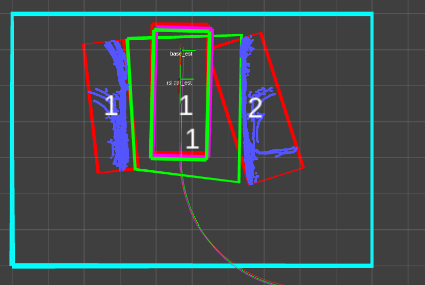
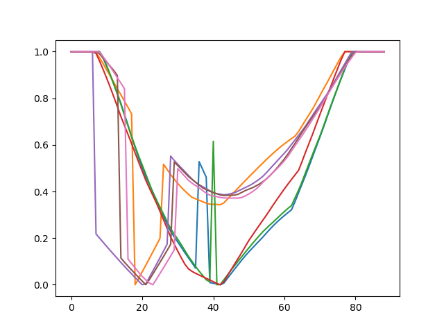

# 第一周

## 2021-01-02

> 新的一年了，元旦借感冒之由，在寝室休息看了几部电影，新的一年要更加努力。

今天的任务是：

1. 总结梳理一下新的消息格式和数据包
2. 周年回顾
3. 看看书

> 今天刚坐下，就和chen去实车上了，他验证了一下修改GPS的可信度的效果是否提高，我拆了一些新的泊车的感知数据。本以为感冒已经好了，但是在车上这段时间真的越发恼火了，晕得厉害，像是晕车了一般。回寝室躺了看电影，买了点药快递过来还挺快。看了几部电影，寻梦环游记，remember~ me~ ，沐浴之王，，曼达洛人。都还挺好看。

## 2021-01-03

> 这周真结束了，有啥进展？没啥进展，被感冒和跨年耽搁了。为了毕业，后面一分一秒都不能耽搁了。认真的态度必须培养起来。

今天的任务是：

1. ~~周年回顾~~
2. ~~看看书~~
3. 总结梳理一下年末讨论的代码。

> 现在是晚上七点, 看看书,结果看得有点多了.自控力，娱乐至死，牛奶可乐经济，图解算法都看了一章，开始努力毕业吧。一晚上也没调试完收发点云的节点，效率有点慢啊！

# 第二周

这周的任务是:

1. 把实验思路和代码调通

## 2021-01-04

>新的一周开启,这周必须抓得更紧了,必须全神贯注,不能不紧不慢的干活了.

今天的任务是:

1. ~~收发点云节点调试~~
2. 卡尔曼滤波器类整理

> 遇到有点棘手的问题,是dsdyaw的频率问题我应该怎么解决呢?

## 2021-01-05

> 今天好烦啊, 又没能出寝室成功,水淹着鼻子了. 必须抓紧任何时间了.

今天的任务是:

1. 看看代码其他的任务.

2. 做个规划:

   2月3日离开, 1月28日查重, 

   1月25日前文章写完

   1月18日整理实验数据，写文章

   1月11日实验

   1月11日前代码调通

## 2021-01-06

> 昨天等于啥也没干。今后必须泡在实验室了，赶紧毕业滚人。

今天的任务是：

1. 调通KF库位检测阶段
2. 调整矩形拟合的参数

> 调试遇到的问题真多，不要慌一个一个解决吧，明天继续。

## 2021-01-07

>还有很长的路要走,集中注意力,加强锻炼专注.

今天的任务是：

1. 调通卡尔曼滤波器
2. ~~调整拟合算法参数~~

## debug:

todo：

- 检测拟合框歪了45°?why?
  - 0~pi/2, dist =0.02  ---->>>>效果好了很多ok
  - divide into 2 parts 而不是4部分，由于点云先被转换到map坐标系下，因此通过讨论原点和点云的关系寻找可视边的逻辑不合理，修正到通过每边点的数量来讨论。简化了好了
  - 在只看见一条边时容易歪：
  
  
  
  ​		新写的实现代码，突然解决。*并没有解决*
  
- 第二次拟合删除点一直为0

- 卡尔曼滤波器输出nan

- ~~关联目标库位~~ **OK**

- 发布tf_slot_map

## 2021-01-08

> 日子过得好快，昨天的代码也有很多没调通。希望这周能把检测阶段的算法调试好。

今天的任务是：

1. 调通第二次拟合的算法
2. 调通卡尔曼跟踪的实现

### debug：

- **关联目标库位**: 

  roi中可能不只有两个障碍物，应快速匹配产生目标位的两个车。

- **第二次拟合删除点一直为0**

> 今天有结束了，不知道为啥我一直卡在讨论库位4个角点排序入口点的地方，这里明明不是很难。我真正想要做的是想把四个点的排序简化到两个有向点的讨论，并且将工况一般化，但是建立两个有向点其实也要进行排序。所以我不必纠结呀，先实现功能再说，每次写一个函数先明确目的，要干什么？输出什么？输入是什么？再集中精力去解决，相信一定能快速搞定。这次就是写着写着忘记了我的目的只是匹配出目标库位。明天加油吧，时间不多了。

/swapfile                                 none            swap    sw              0       0

## 2021-01-09

> 已经周六了,昨天也没做什么,倒是熟悉了一下代码2333,今天全神贯注. 一下午也没干啥，我必须拿出更多时间了。

今天的任务是:

1. ~~关联目标库位~~
2. 第二次拟合算法
3. 卡尔曼滤波

### 问题记录

- 全部转换到map坐标系会有问题，我的定位结果如何与rt3000比较？必须在库位坐标系下比较，默认了一个坐标变换

- 坐标变换还有问题,将自车位置转换到库位坐标系时不能使用原点了.必须把车辆原点在map坐标系下的坐标输入 **ok**

- 所有角度全部饱和？拟合参数还有问题。----->>
- slot_type wrong???
- 关联库位时某一帧断掉后，后面的就关联不上了.

## 2021-01-10

> 今天最后一天了,又没能出寝室成功,实在是汗颜~.必须一个问题一个问题的着手解决,不要想太多.

今天的任务是:

1. ~~tracker理顺~~
2. 第二次拟合算法.

### 现在的问题有：

1. 库位坐标系的转换,其中xy**正方向错了 OK**

   **调整** 将AB的角度都规定为库位边的角度——__angle_A_B

2. 库位坐标系的原点，即入口点有时候选错，可能是第3点和第4点造成的 **OK**

3. 障碍物关联有时会出现错了**OK**

   调整为NN关联总代价最小也会出错，NN关联寻找最近的两个障碍物，也会出错.

   用库位角点关联障碍车就不会错了。

4. 库位4个点排序会出错，*break***OK**

## todo记录

- 把一些参数写到launch中：这样就不用重新编译了
  - searching：DEBUG_enable, Tracking_chen_enable.

# 第三周

本周任务是：

1. 检测阶段算法调试好
2. 跟踪阶段算法调试好

## 2021-01-11

> 第三周开始了，不用抱怨，使劲干。

今天的任务是：

1. KF滤波器工作
2. 第二次拟合算法

### debug记录

1. 库位4个点关联错

   - 系障碍车聚类没有被分类为车。-->调整分类阈值

   - 还是会出现关联错。 --> 系由矩形框推出4个库位角点出错，其中一个矩形框太小了,也许可以通过跟踪每个框的最大尺寸解决.

     

   - 基于pin_point 延伸边长的时候，*正负号*容易错，特别是pin_point切换的时候。-->>不改变`extend_x`符号

   - 当车长小于车宽的时候，容易把车宽按照长边延伸。-->>跟踪box的方向, 变化太大的时候,重新变换BBox的坐标系和正负号。

   - 拟合框bbox角度的定义：0~pi/2. devide_points里面给的angle的旋转矩阵是(cos angle, -sin(angle)), 而我拟合时e1是（cos（angle），sin（angle）），差了90°，虽然拟合的结果是一样的，那是因为他总是用的minmax坐标。但我试图改变长宽时就可能反调。！！！还是不对，devide_point里面是右乘点坐标，实际上还是一样的。

   - 搞清楚了BBOx的完全定义和fiiting拟合的坐标系： 

     
   
   - 还是不太行,烦躁,应该怎么做?

   

2. 一开始输出的Bpose目标点找错了

    

## 2021-01-12

> 昨天那个问题一天都没解决掉,今天尝试一下,实在不行就先放一下,先解决优先的问题

今天的任务是:

1. ~~调试box关联~~
2. 调节卡尔曼滤波器
3. 调节第二次拟合算法.

### debug

- 库位扩展错误
  - 检查了昨天的思路，应该没问题，修改了pin_point改变时的逻辑，并删除检测结果偏差太大的帧

- 挨个讨论了一下所有角度以及pin_point的改变，算是有了较好的效果，花了**1.5天**时间，必须明确下后面的主要任务了：

## 主要残留TASK：

1. ~~拟合结果欠佳~~
2. ~~第二次拟合~~
3. ~~KF滤波多帧检测结果~~
4. 收取底盘信号
5. EKF定位，及坐标转换
6. benchmark switch
7. ~~采集场景实验~~
8. 论文撰写和修改、评阅

## 2021-01-13

> 从10号到现在一直在调试同一个问题，每天都在认真的额解决，还是卡在这里。昨天到最后也没有放下这个问题，我今天是最后期限了，下午解决不掉就放弃吧。还要准备文献分享。赶紧毕业吧，上天保佑

今天的任务是：

1. ~~修改box长宽扩展方法最后期限~~
2. 调整运行KF滤波

### debug

- 库位box扩展错误 **ok**

  - 看起来是因为，pinpoint变化到不可能的y轴点去了，变过去之后还没能被我识别。会不会由于下采样和取边缘点的影响，-->调大edge阈值0.36~0.6试试

  

  - **3天** *终于搞定了，期间的问题太多。基本上我认为不可能的情况，没有在if else中讨论完全的情况全部都发生了问题，还是我太嫩了呀，考虑不周全。*

> 耗时3天的这个小功能总算完成了。一开始把它想得太简单了，就想随便写写，结果bug出奇的多，代码也越写越冗余。好在最后终于摸清楚了各个变量，讨论得也比较清晰。得到的3点经验一定要好好记住：**1、以后if else一定要涵盖所有可能的情况，及时你认为不可能发生的情况也要算在其中。2、代码调试一定要写好cout提示流帮助分析，可以节约太多时间了。3、讨论工况中尽量避免要素耦合，分开讨论，卧槽，这不就是高中数学吗**。总而言之，还是自己的算法能力太差，编程练习不够，可以抽空多刷刷题。好在C++算是入门了吧，总算可以利用这个工具给自己的算法打工了！！喜悦感还是有的，尽管看起来是个小问题，里头门道还是挺多的。

## 2021-01-14

> 新的一天，终于早上起床了。今天也要加油，还要抽时间看看文献分享

今天的任务是：

1. ~~topic可视化整理~~
2. 调整运行卡尔曼滤波 *//还没开始*
3. ~~文献分享准备~~

todo:

- ros::spin(), ros::Duration(), ros::Sleep()

## 2021-01-15

> 又是新的一天了,时间不等人.抓紧

今天的任务:

1. ~~文献分享PPT~~
2. 调整KF参数

### debug

1. 结果会发散，打印出来也不好看。所以先看看matpilot画图怎么用。

2. 扩展宽度存在一个隐患，当基点变的时候会把关键库位角点也扩展，导致库位尺寸变小

## 2021-01-16

> 16号了，加油干啊。一个一个解决，不要慌，技术宅男玩这个很正常嘛

今天的任务是：

1. 改善拟合算法
2. 调整kf

### wenti

拟合算法真的需要好好的修改改进一下。因此，我们先学学matplotlib

**old fitting**

**new f**

**no eta**

new fitting without saturation, 0.2^2

new with same para as old . sat is 0, 0.2^2

new with same 0.4^2

old 0.6^2

## 2021-01-17

> 最后一天了，过得好快啊。28法则我连20%的时间都没有付出。今天再次没有常规时间学习

今天的任务是：

调整拟合算法和第二次拟合

# 第四周

## 2021-01-18

> 最后一周了，我该紧张起来了

今天任务是：

1. 调整拟合算法和第二次拟合

### debug1

**到底d0阈值选多少？**

1. old_d0=0, no saturation, eta =1.

   

   这几个凸起是什么？--> 猜测是计算边发生了切换

   若是这样,看看new方法是否有改善

2. new,d0=0,no satuation,no eta

   

3. new, d0 =0.2 , no sat====///////////////////////////////////

   

4. new,d0 = 0.225 nosat===/////////////////////////////////////

   

5. new,d0 = 0.25 nosat

   

6. new, d0 = 0.3 nosat

   

7. new,d0=0.45 nosat

   

8. new,d0 = 0.6 nosat optimal_angle == 0

   

   最优角一直保持为0，因为所有最佳角度cd均小于d0.

看起来还是0.2~0.25之间最好，饱和的没那么多，仿真诚不欺我。但是饱和的角度就是最佳角度吗?

### debug2

**加入satuation中值处理**

satuation与max_loss并不是同时出现, 想想只有一角饱和了, 另一个角可能没饱和,数值在变化.二者等同的唯一情况就是两个角都饱和,这对于有圆角和后视镜的情况基本少见. 

单独采用两者都不是很可靠.

## 2021-01-19

> 新的一天到来了，昨天的调整没有什么用。静下心来，一个一个琢磨。不要想着有多大的改动，先把毕业要求的做完吧。

~~调整拟合算法~~

### debug

1. 让我们回到阈值d0的情况.

- nosat,d0=0.18

- 确认了用的肯定是长边的两个角
- 尝试了调和平均数和距离之差作为评价项，初步效果不好，没深入

- 加入了**角点距离差值惩罚系数**和**正比与点云数量的加权系数**，精度和稳定性都好了一些。但是惩罚系数只是加大了对非优结果的双重保险，防止过偏结果的出现；加权系数是依据点云的临近情况自行确认的，不用调整。需要调整的就是**d0距离阈值**，但是目前的调参看来影响并不大。

- 同时，这样可以获取*角点距离的换算值*。
- 看看内部点云影响如何？两个拟合框一直保持一致。

2. 存在一定问题：

   - CD0的（1-k0）权重更大，即框倾向于圆角点，因为那部分的点云更多

   - $$
     Score =2K/( (1-k_0)max(CD_0,d_0) + k_0max(CD_1,d_0) ）;
     $$

     如上式，想加大端角点CD~1~ 的权重，只能降低d~0~，效果并不明显，目前取0.05m。

3. **比较一下用均值和EKF分别跟踪障碍车box的angle看看** TODO

## 2021-01-20

> 今天起床又失败了，现在晚上才过来。能干多少是多少吧，希望月末能吧实验做完。

今天的任务是：

1. 二次拟合调整

## 2021-01-21

> 突然就周四了，疫情也加重了。昨天休息了一天，接下来都锻炼一下自己的专注力吧。不知道我2月1号来得及写完论文不，实验肯定不会顺利的，我心里有数，只能看2月13号来得及不

今天的任务是：

1. 二次拟合调整
2. KF滤波调整

### debug

1. 

   -->>对max_2nd_diff小于15的全删除

2. 

   --》增大``_dist_step_of_grad`到15个

3. 旋转矩阵的正负

4. 为什么去除的一直是短边而不是长边呢？逻辑下标没有错啊。

   到底是哪里不对？还真是必须反过来。。。。。脑子抽了，x方向长，dist当然是to y轴的哎呀

## 2021-01-22

> 空气中弥漫着一股回家的气息，不想学习的气息。赶紧把论文写完解放一段时间把。

今天的任务是：

1. 把后视镜删除的代码放在lidarvehicle下面
2. 启动KF

> 玩了一晚上游戏，明天开始好好学习

## 2021-01-23

> 今天去采集一波数据，事实是就算看起来再简单的东西，实验的时候没有理解透彻的地方都会出现问题，一整天也没有搞定

## 2021-01-24

> 大问题应该都解决了，今天去采集足够的库位吧。最后一周时间了，抓紧。然后晚上如果还有时间把前天的任务做一下——把后视镜删除的代码放在lidarvehicle下面

今天的任务是：

1. ~~采集泊车数据~~
2. 整理检测算法

# 第5周

> 不知不觉这个月就到最后一周了, 感觉实验终于不被语言困扰了,但是进度依旧可怜. 上周有所懈怠,整个学校的空气中都弥漫着放假的味道, 日益紧张的疫情氛围、就地过年的纠结、同学的相继离校都让我丝毫不在状态，虽然这些都是借口，我知道根本的原因还在于我自己，是懈怠了。明确一下时间节点，进展顺利的话，31号之前实验做完，3号之前论文搞定给老板审核，13号送去抽盲。最坏的情况也要保证18号之前能够抽盲。前者的话我可以回家好好享受一下，后者的话就只能留校心情忐忑的科研了。孰好孰坏希望你能搞清楚。

这周的任务：

​	**攻坚EKF检测和跟踪！！！！！！！**

## 2021年01月26日

> 昨天啥也没干，中午过来玩了一下午农药，晚上又玩了一晚上ow。游戏没什么好玩，特别是一个人玩竞技类游戏，不会显得非常的孤独吗？今天下午去把三方的事情搞定了，从现在开始要十分百分的投入了。已经周二了。

今天的任务是：

1. EKF检测库位

## 2021-01-27 Wen.

> 今天的10点到的,加油吧,想到后面还有那么多事情.

1. ~~点云修正输出~~
2. KF

### 截图

1. 现在就是后视镜挺长的时候，容易翘起来，有一端权重还是太大了。
2. 在泊车入库的过程中库位关键点的关联容易失效

## 2021-01-28 The.

> 今天早上也没来，2月3号的节点是赶不上了，以13号为目标吧，但还是希望月底能实验做完。总之每天至少解决一个问题，有所进步。这就是我现在的实力，不要去和别人比较，踏踏实实完成一个令自己相对满意的毕设吧。

1. KF库位检测QR参数调节

## 2021-01-29 Fri.

> 昨天调了调参数，效果不是很好，今天加把劲了。一月份又没了，这日子过得奇快。
>
> 效果不好，根本原因在于单帧点云跳动还是太大，拟合的结果并非所有时刻都能很好的反应方向，后视镜去除也并不完全。

1. ~~用之前的拟合方法试试。~~
2. ~~现有条件下尽量去调整qr~~
3. 选取单帧效果好的作为真值
4. *将多帧点云用行位推算融合在一起*
5. 收取底盘信号，解决采样周期不同的问题

### debug1单帧拟合结果改善

- Lorientation看起来效果最好，var在内部点云和非L型点云表现较差，minCD对U型的适应性更好,closeness最差，但是稳定
- *考虑利用随机采样一致性的想法，用点数作为判据*
- *考虑跟踪每个box，并对每个boxKF滤波*
- *考虑利用行位推算融合点云*

-->> 添加了库位角点入口点的错误处理

-->> 添加了minCD K0的饱和限制, ==端角权重大，翘得还是比较厉害

​	 -->>调大edge(0.3-0.35)、K0(0.88~0.85)、d0(0.05-0.1)的限制，以减小端角权重 == 依然如此

​	-->>继续增大0.4、0.9、0.15 ==不一定，时不时圆角，时不时端角，

​	-->> 调整0.5、0.88、0.12 == 效果还行，依然不稳定

### debug2 KF

-->> 增大后阶段观测值的可信度 R小 == 效果不明显

- 考虑利用其开始滤波前的检测结果的theta,加快收敛-->>这在固定坐标系下比较好用，而不是lidarsys，*所以直接对每个box跟踪更靠谱*

-->> 后调开始滤波的时刻 == 的确会好很多，但是滤波数量变小到80次左右，近乎收敛。

-->> 微微调整 0.3，0.88不变，d0=0.1~0.15开始往端角倾斜 0.125

-->> 微调R，变小到0.05==y就是一直不收敛/////////////不好调

-->> R 0.5 0.3 10 + 0.1 0.1 3 , 调前开始时间<3m  == 初始观测值还是很重要的，3m不行

-->>宽度方向上点云就不要去除了吧 == outlier会影响x

## 主要任务残留

1. ~~收取底盘信号~~
2. EKF定位，及坐标转换
3. benchmark switch
4. ~~采集场景实验~~
5. 实验数据分析
6. 论文撰写和修改、评阅

## 2021-01-30 Sat.

> 中午来的。时间不多了。Fight!!!

今天的任务是：

1. ~~看看lasermapping，用不同线程收取底盘信号~~

## 2021-01-31 Sun.

> 又是中午才来。这个月最后一天了，该紧张起来了。

今天任务：

1. ~~调通EKF~~

> 最后一天也结束了。我明天得把库位真值坐标系输出，才能获取RTK的位子估计数据和DR的估计数据

