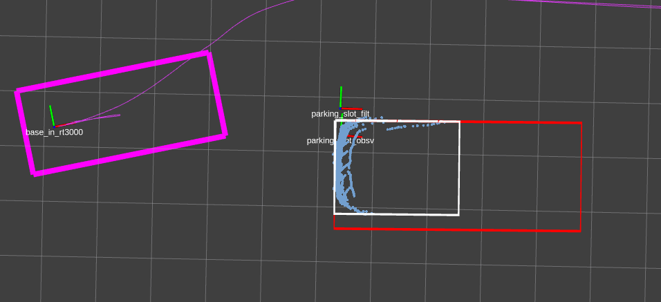

# 第一周

这周必须完成所有工作，过个好年

## 2021-02-02 the.

任务：

1. EKF真值输出
2. EKF参数调节

> 昨天休息，今天被坐标变换搞得心态爆炸

## 2021-02-03 Wen.

> 今天早上算是起来了，昨天被tf搞晕了，最后也没能成功收到真值和DR。时间不多了，周末必须开始写论文了。

任务：

1. EKF真值、DR输出
2. EKF参数调节

## 2021-02-04 Thr.

> 昨天学院晚会 ，晚上出去吃火锅了，啥也没干。这两天真的是什么都没干了，状态不对呀。

任务：

1. ~~EKF真值、DR输出~~
2. ~~修改benchmark switch的依据~~
3. EKF参数调节
   - 调节measure阶段的EKF参数
   - 调节跟踪阶段的参数效果

### debug1

- angle:
- 

原因：从Isometry3d中读取欧拉角ZYX[0]的时候旋转角范围是0,pi

-->利用角轴旋转读取Z分量

```C++
Eigen::AngleAxisd rot;
    rot.fromRotationMatrix( tf_slot_lidar.rotation());
    double Z_angle = rot.angle()*rot.axis()[2];
```

### debug2


描述：measure end时候，slot_obsv坐标系飘了

原因：大概是库位检测结束后，lidar到slot_obsv的变换关系不在改变了但是lidar依然在变，因此slot_obsv就飘了，但是怎么会飘这么远呢？

应该是switch benchmark后重新发布的tf没有重置为单位矩阵. 正解

### debug3 修改benchmark switch的依据 

- 1/11 加权单目标
- 归一化，$\Delta s/\Sigma \Delta s$delta

### debug4 EKF


- 库位内部的定位效果很差呀。

**原因：**1. 在库位内的时候，不能正确跟踪拟合框，出现拟合框方向反转

2. 拟合框角度偏差太大的情况下，不能正确识别4个库位点

   **拟解决：** 不要去找每个矩形的两个库位点，而是4个点都与之前的关联

3. 滤波器对行位推算的权重偏差太大

### 其他待解决问题

​	1. 拟合算法效果不理想


## 2021-02-05 FRI。

> 慌了呀,越来越慌了,我必须以论文为优先,抓紧实验吧. 

任务是:

1. EKF参数调节
   - 调节measure阶段的EKF参数
   - 调节跟踪阶段的参数效果

### debug1

 


- 乱七八糟的图, **问题有二：**

  1. RTK和DR定位数据与雷达没能匹配上来，**行位推算权重没能体现**

     -->>单独输出滤波器预测的值作为行位推算轨迹观察。==与DR一样的，我手动对齐一下好了,见上^

     -->>将K置零，就是纯粹的行位推算，如何效果？==如下蓝色，*证明简单的将真值平移是不能对齐的，**还需要旋转***。 

     ​		->>单独输出滤波器预测的值作为行位推算轨迹观察

     

     -->> 删除了观测值太大的帧参与KF，旋转用当时的预测值代替  ==？？

     

     -->> 看起来对观测值的可信度还是太大，减小Q增大R。==？？？

     

  2. **库位内观测值可靠度太低**。

  > 就工作了一上午，下午突然悲从中来，然后玩了一天，胡适之啊胡适之。过去是属于死神的，未来是属于天堂的，只有当下是自己的。必须抓住每一份每一秒，干活，早点毕业滚蛋。

## 2021-02-06 Sat.

今天的任务是：

1. 调节检测阶段的定位参数。
   - 增大DR的权重
2. 调整入库阶段的定位
   - 改善库位内的观测值

### debug1 前进检测阶段定位

**行位推算权重没能体现**

> 昨天
>
> -->> 删除了观测值太大的帧参与EKF，用当时的预测值代替  ==？？
>
> -->> 看起来对观测值的可信度还是太大，减小Q增大R。==？？？


-->> 先只看前进阶段，观测值和rtk还是比较吻合的。*DR的theta有问题* ——>>系单位没有转换到角度  == 比较正常

-->> 为什么我输出的drpose和DR差这么多？ == 知道了，*我的OV_pose是lidar的原点而不是base_link的原点*

- -->> 需要转换一下，都到base下去吧。-->>收取tf_lidar_base, 将lidar原点坐标变换为base在slot下的坐标 == 可 以

-->> 是不是可以提前发布tf_slot_lidar, 因为库位检测之前就可以看到较远处车辆的角进行定位了  == 可以

- -->>EKF在6m前就开始定位滤波，将滤波后的结果发送到tf中

-->> 是不是先记录下end的时候filtered的值当成真值，再重新运行获取RTK和DR的值 == 可以

- -----------------------tf_slotFilt_map, trans is : 
  15.785 -1.56549  3.72096
  rot is: 
     0.998669  -0.0483091  -0.0180546
    0.0483254    0.998832 0.000466989
     0.018011 -0.00133886    0.999837
- -----------------------tf_slotFilt_map, trans is : 
  15.8077 -1.5522 3.72103
  rot is: 
     0.998695  -0.0477702   -0.018043
    0.0477846    0.998858 0.000369091
    0.0180048 -0.00123079    0.999837

-->> dr_pose受到初始值影响较大，看来我***不能使用这个行位推算了。*** 

- 但是我的观测是融合了行位推算的啊，我只能用行位推算的初始点作为地图起点。===？？？？？绿色的航位推算不能用


-->>手动设置好slot_filt，调整前进段的EKF参数.

- 

- -->> X方向存在一个稳定的误差，定位可能真的和初值有很大的关系。**初始时刻**就不准确，后续的预测偏差会越来越大，限制了卡尔曼滤波的收敛。

### debug2 库位内

-->> 库位内拓展矩形框感觉起到了反作用

-->> 依靠lidar坐标系下的两个连续帧点云差值跟踪和判断switch可靠性的方法不太好！！！-->>看看能不能用map坐标系下的差值来判断是否可靠,进而变换switch

# 第二周

> 昨天也没有工作，上一周的状态及其不对。这周就是新年了，我已经来不及了。除夕之前沉下来认真搞吧，不要太在意细枝末节，重点放在毕业的工作上。

## 2021-02-08 Mon.

1. 调节检测阶段的EKF参数。
   - 增大DR的权重
2. 调整入库阶段的定位
   - 改善库位内的观测值

### debug1 检测阶段

>1. -->> dr_pose受到初始值影响较大，看来我***不能使用这个行位推算了。*** 
>
>2. -->> X方向存在一个稳定的误差，定位可能真的和初值有很大的关系。**初始时刻**就不准确，后续的预测偏差会越来越大，限制了卡尔曼滤波的收敛。

- dr_pose受到初始值影响较大，看来我***不能使用这个行位推算了。*** 
  - -->> 增大初始时刻的协方差矩阵 P0 
    - 滤波值与dr重合 ? ? 
    - 
  - 调大P0和增大Q？-->>Q：0.03，0.3 P0: 0.5, 5.0 == 前期还是重合，**初始值**对行位推算的准确性. ！！
    - 
  - 为什么初始时刻，y方向差这么多？
    - -- 调节到10m前开始定位，之前是B车前6米
    - -- 增大P0，y-1.0
    - == 
    - == 不够平滑，就*不要画绿色这条线了*直接看紫色的线，就不用对齐了
    - -- 调节P0~0.1，0.3，3.0
  - y方向上跳动也非常大，我想是不是因为我去除凸出点了太多？？**果然不管跟踪怎么调，必须检测准确才行**
    - -- 修改了强制删除少数点的依据  <10， N>200
    - == 发现大部分去除的点都是通过强制删除的。梯度算法是不是没起作用？
    - -- 修改mv_points,  添加限制条件N>200, 减小最小点数要求10，增加最多删除点数限制<30
    - 
    - 如上，用max_2nd_diff不准确，应该用diff的变化率. == 重新写了判定mv的依据
    - 初步看起来检测框好一些了，看看y方向的滤波会不会好一点了？

- -->> X方向存在一个稳定的误差
  - lidar到base转换错误了吗？ -->>extrinsic求逆一下。== OK


- 看起来好多了，只是库位里面观测容易乱飞

## 2021-02-09

> 昨天静不下来，去看了部电影，送你一朵小红花。最后算是让算法大致能看了。

任务：

1. 前进阶段
2. 库位内阶段

### debug1

- 前进阶段看起来还能再调节一下
  -  y方向突变太大的观测值看能不能处理一下？
  - -->> 之前是通过getObsvValidFlag()判定当前观测值是否有效，利用dr代替观测值
  - -->>处理都放到trackor里面，valid——rule：+0.2f +5°
  - ==
  - 前面的波峰怎么没有处理? -->>filtered_ov_pose初始值没设定

### debug 2 库位内


- 库位内如图容易发生库位4个点关联错误
  - -->错误判断的时候就重新拟合吧
- 
- 这种时候并没有switch？因为前后两帧diff变换并不大

## 2021-02-14 Sun.

> 今天已经过完年了,改收心了.一切以抽盲论文为主,实验也不要在乎细枝末节的东西了,赶紧写完毕业吧.加点紧.

### debug2 泊车入库中

1. switch逻辑修改

   1. -- 利用自车和库位的相互位置关系确认是不是要switch？--如何在lidar坐标系下判断自车和目标的相对位置？？不好办!!

      ==**not OK**

      -->>利用ov_pose正负判断，**OK**

   2. switch没有改变从lidar到base的坐标系变换输出 ===OK

2. 库位内调整的时候，关联的角点容易出错。？？

   

   - 末尾一段完全靠DR的轨迹就是因为找到的4个库位角点发生错误，处理观测值的时候算法发现偏差太大，用dr值代替了。？？？

   ​	--> 当*判断为无效*（how）的时候重新匹配库位的4个点。

   ​	== 重新NN关联仍然不行，因为点云过于残缺，拟合框偏差太大???**not OK**

   ​	-->最开始出现匹配关联错误的时刻是因为，只能看到车屁股，矩形框长度变特别小，A2点关联错误了。？矩形长宽都拓展试试

   ​	==不行，拓展长宽失败后的异常处理，会重新拟合边框，也没有拓展。归根到底还是之前的拓展长宽算法的问题。**not OK**

   ​	-->> 补充了一点异常处理的处理。==**OK**, 但是*还是会出现排序错误*

   ​	-->>我想还是得在静止坐标系下进行关联才行。------------todo


- 跟踪目标拟合框的时候，都是在车辆坐标系下的，其角度的变化是与横摆角速度高度相关的，所以利用前后帧跟踪不太可靠。

  -->>添加dyaw补偿到计算前后帧的差值算法里 == 没什么错误，效果有待评估，暂且OK

  

3. 库位内调整的时候，y值偏小？

原因在于点云的确看不见，有什么办法呢？硬伤


# 第三周

## 2021-02-15 Mon.

> 今天已经快来不及了，不要考虑太多算法的东西，先把论文写出来给老板。

1. 实验所有场景，按平行和垂直的来
   1. 确认roi区域
   2. 输出真值坐标
   3. 输出数据

### 17-15-para

1. roi

```C++
roi << 4, 21,
            -4, 0,
            0.45, 1.5;
    init_slot_obstacles_center[0] << 6.5, -2.8, 0.0;
    init_slot_obstacles_center[1] << 18.0, -2.0, 0.0;
```

2. slot_filtered

-----------------------tf_slotFilt_map, trans is : 
 15.8367 -1.45827 0.183644
rot is: 
   0.998599  -0.0495327  -0.0185933
  0.0495143    0.998772 -0.00144763
  0.0186421 0.000524969    0.999826


-----------------------tf_slotFilt_map, trans is : 
 15.8369 -1.45882 0.182924
rot is: 
   0.998548  -0.0505792  -0.0185332
  0.0505618     0.99872 -0.00140682
  0.0185807 0.000467707    0.999827


3. 输出数据，库位内过于残缺。。。。

### 17-22-para

1. roi -s 13

```C++
roi << 1, 18,
            -4.5, 0,
            0.45, 1.5;
    init_slot_obstacles_center[0] << 4.5, -2.8, 0.0;
    init_slot_obstacles_center[1] << 14.5, -3.5, 0.0;
```

2. slot_filtered

-----------------------tf_slotFilt_map, trans is : 
    12.4117    -2.19039 1.34428e-18
rot is: 
  0.999486  0.0320453          0
-0.0320453   0.999486          0
         0          0          1


-----------------------tf_slotFilt_map, trans is : 
 12.3874 -2.20057 0.111932
rot is: 
   0.999776   0.0152149  -0.0147396
 -0.0152165    0.999884 3.24505e-06
  0.0147379  0.00022104    0.999891

3. 输出




- 为啥obsv会到那里去，明明拟合框没有失效。


### 2021-01-24-17-09-30_pengyuan_para.bag

1. roi -s 3

roi<< 3, 19.5,

​            -4, 0.5,

​            0.45,1.5;

​    init_slot_obstacles_center[0] << 6.0, -2.5, 0.0;

​    init_slot_obstacles_center[1] << 16.5, -1, 0.0;

2. GT

-----------------------tf_slotFilt_map, trans is : 
  14.7668 -0.478968  0.159903
rot is: 
    0.98779   -0.154701  -0.0184231
   0.154692    0.987961 -0.00193411
  0.0185005 -0.00093941    0.999828

-----------------------tf_slotFilt_map, trans is : 
  14.7058 -0.492572  0.155601
rot is: 
    0.987574    -0.156068   -0.0184244
    0.156059     0.987746  -0.00196521
   0.0185053 -0.000934496     0.999828

3. shuchu

定位误差是泊车开始后的定位误差，即KF结束后的误差.可以把EKF分成两部分, KF结束后给EKF归1

### 垂直库位 val ver

1. roi  -s 5

```c++
//2021-01-02-17-02-51_valleyball.bag valleyball ver slot -s 5
    roi << 10,20,
            1, 10,
            0.2, 2; 

    init_slot_obstacles_center[0] << 11.5, 5.0, 0.0, 1.0;
    init_slot_obstacles_center[1] << 17.0, 5.0, 0.0, 1.0;
```

2. GT

-----------------------tf_slotFilt_map, trans is : 
  15.5753   2.98693 0.0772097
rot is: 
   -0.999927  -0.00798828  -0.00909228
  0.00799041    -0.999968 -0.000198552
  -0.0090904 -0.000271189     0.999959

3. **shuchu**

对于垂直库位拓宽宽度看起来影响挺大。

- 完全用的航位推算，观测值全部失效invalid


-->>看起来是角度差了360°

-->> 我把diff——yaw约束了一下，不会一直无效了

==

== ov_pose的角度正好在180°左右时，滤波器不会突变所以导致这种现象。？？

-->> 判断差值太大的时候，加2pi

==ok

- 入库阶段观测值看起来权重太小==修改好角度后，正常了ok


库位内y方向会产生偏差

### jiaoyun-ver2

1. roi

```C++
roi << 5,13,
            -6, 0,
            0.45, 1.5; 

    init_slot_obstacles_center[0] << 6.5, -4.0, 0.0, 1.0;
    init_slot_obstacles_center[1] << 11.50, -3.5, 0.0, 1.0;
```

2. GT

-----------------------tf_slotFilt_map, trans is : 
  10.1634   -1.2438 0.0425201
rot is: 
    0.98036   -0.196999 -0.00927026
   0.197025    0.980396  0.00204506
 0.00868565 -0.00383137    0.999955

-----------------------tf_slotFilt_map, trans is : 
  10.1795  -1.24782 0.0418767
rot is: 
   0.980759   -0.195007 -0.00917694
   0.195034    0.980794   0.0021082
 0.00858957 -0.00385745    0.999956

-----------------------tf_slotFilt_map, trans is : 
   10.057  -1.25569 0.0469448
rot is: 
   0.980535    -0.19614 -0.00892101
   0.196163     0.98057  0.00178304
 0.00839794  -0.0034983    0.999959

3. output


- 随着右边点云形状的巨变，4个库位点容易发生错乱。**很多问题都是由此引起，因此在map图中解决这个问题比较理想**

  --系代码写的异常处理是错误的，注释掉？

  ==

  

### jym-ver1

1. roi 

roi << 5,13,

​            -8, -1,

​            0.45, 2.0; 

​    init_slot_obstacles_center[0] << 5.5, -4.5, 0.0, 1.0;

​    init_slot_obstacles_center[1] << 10.50, -4.5, 0.0, 1.0;

2. GT

-----------------------tf_slotFilt_map, trans is : 
   9.60878    -2.7774 -0.0173656
rot is: 
    0.998991   -0.0448013  -0.00308961
   0.0447997     0.998996 -0.000563711
  0.00311176  0.000424729     0.999995
-----------------------tf_slotFilt_map, trans is : 
   9.61903   -2.78084 -0.0205277
rot is: 
    0.999172   -0.0405587    -0.003166
   0.0405569     0.999177 -0.000613571
  0.00318828   0.00048466     0.999995

3. out


一旦某时刻拟合有问题，4个角点的顺序关联出错后就一直不能回归正常,要么一直错误，要么一直无效用dr代替

怎么纠错补偿都不行，**四个角点的关联出错的本质原因还是在于拓展长宽的方向错误引起混乱，而我本来拓延长宽的目的就在于4个角点的关联。**因此我在想是不是可以通过静态地图来搞。