# 第一周

## 2021年3月1日，Mon.

1. 修改论文，摘要和结论，送评阅
   - X方向最大误差的情况分析：主要原因+次要原因，定性定量，数据支撑
   - 与（检测）单线和（跟踪）DR的对比

## 2021年3月4日，Wen.

1. 梳理论文逻辑，分析清楚问题

   1. 量化 定位的误差。

      -->>按照相对位置关系，更换定位的基准试试

      -->>分析最大误差量化其构成

   2. 由单线和DR引出问题分析 -->> 对比性能和改善的地方

2. 制作PPT（3月9号）

## 2021-03-05，Thur.

1. ### 分析jiaoyun-ver2，修改算法

   1. 最大误差情形1，残缺+噪点？

   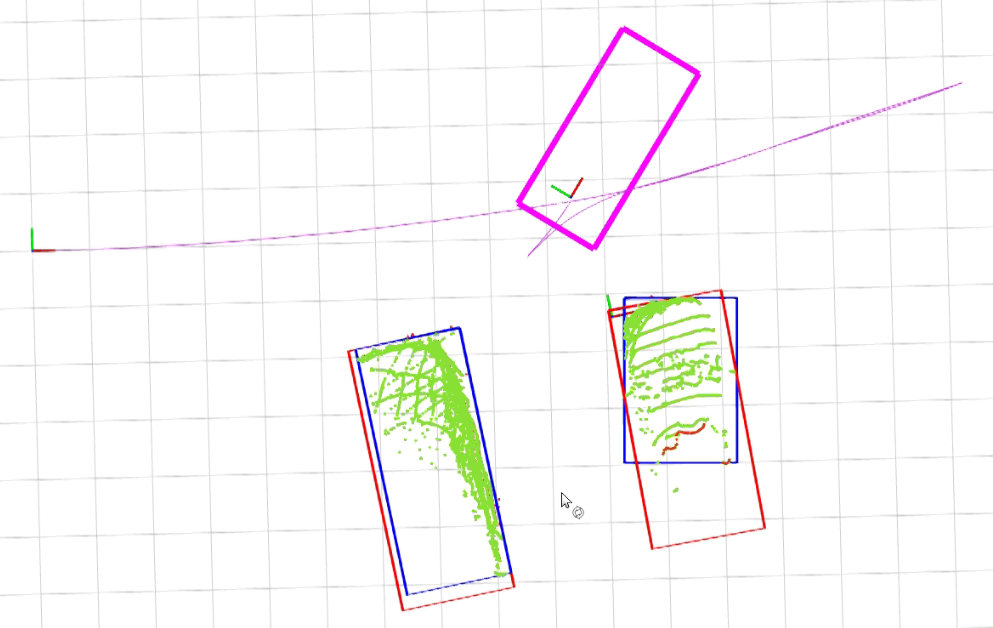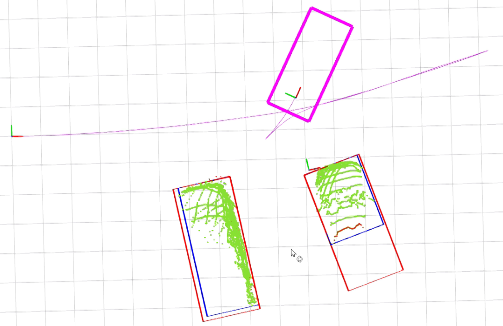

   - 加入统计滤波看看噪声点效果如何，

     == 滤波参数25\1.0，过滤太多了，调小一点. 较远的地方B车点云已经被删除了大部分。

     ==25\3.0,要好一些了，当噪点还是很抖动

     ==25\2.0, 点云太小，偏向1.0

     ==35/2.0，还是很小

     == 40/2.5，

   - 长宽的拓展方向总是有错会一直抖动，会不会带来的误差比不拓展还大？

     == 为啥拓展长？为了解决库位的四个点找不准？——但是拓展不准，反向之后更会造成4个点排序混乱，是否有必要？

     ==为啥拓展宽？为了弥补看不到圆角。感觉没啥必要，更换定位路标更重要。

     == 尝试取消拓展，效果如何？

     - 无拓展

     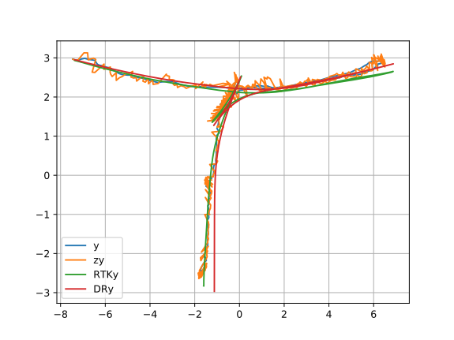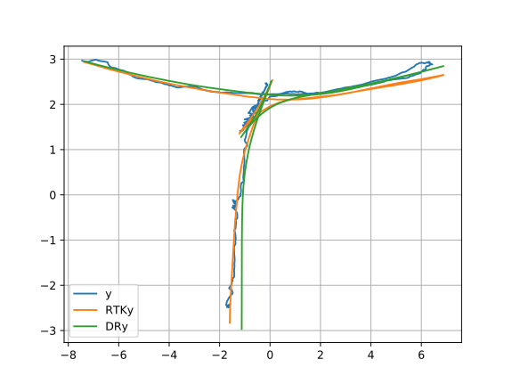

     - 拓展

     

     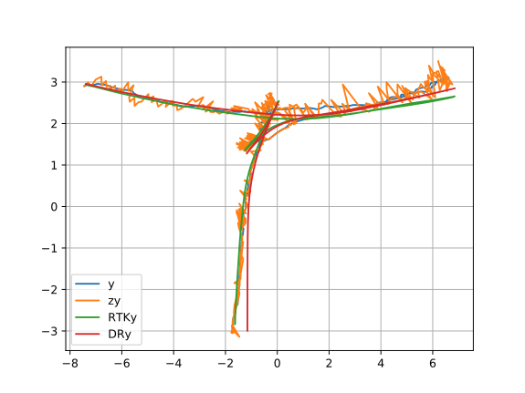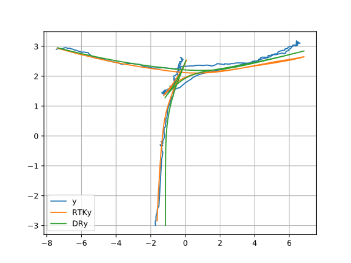

     == 从观测值来看，不拓展好那么一丢丢；倒车大转角处拓展就会很差，直接失效启动行位推算了。最后位置y方向拓展会好一些

     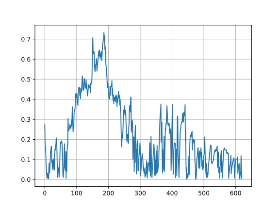

     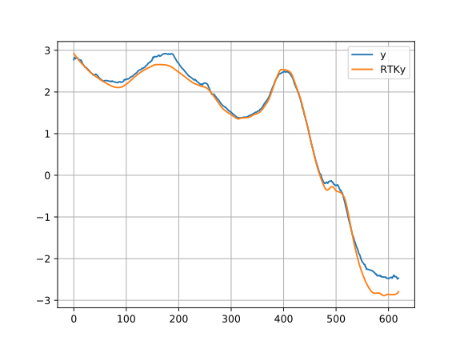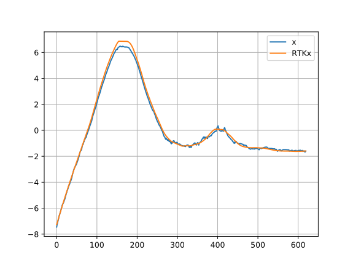

     ​                                                           

     

     

   - 按照相对位置关系判断以哪一个做为基准点？

     == 对比下有switch算法和没有的差别

   

   2. 标的真值也发生了偏差，坐标转换过程中有偏差？

   

   

   

   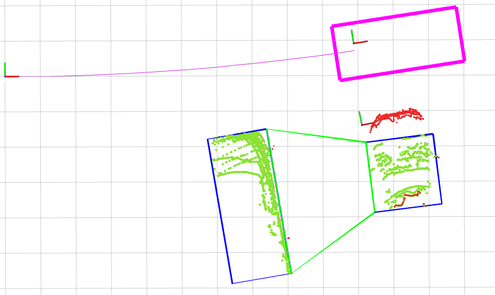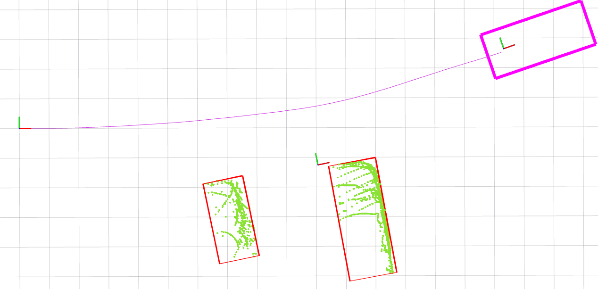

   

   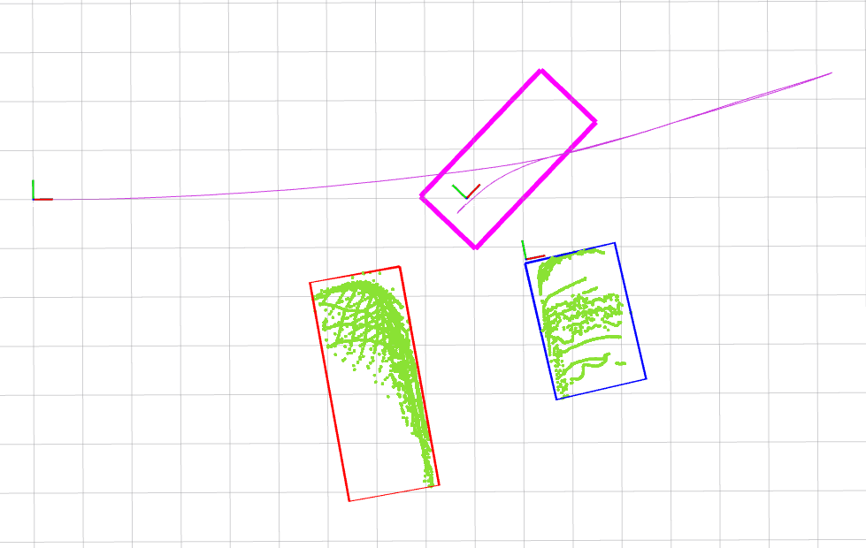

   

   

   

   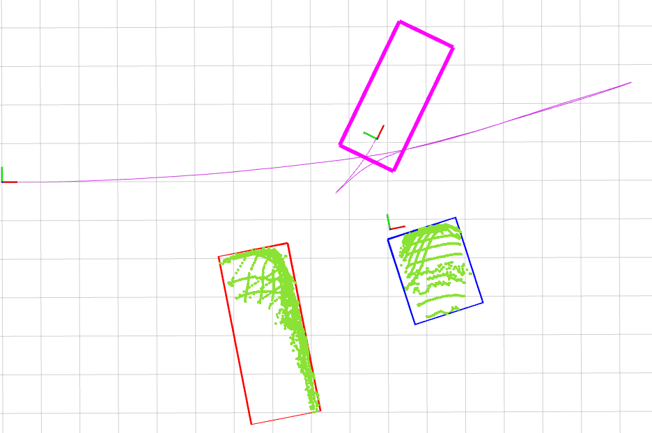

   

   

   

   

   

