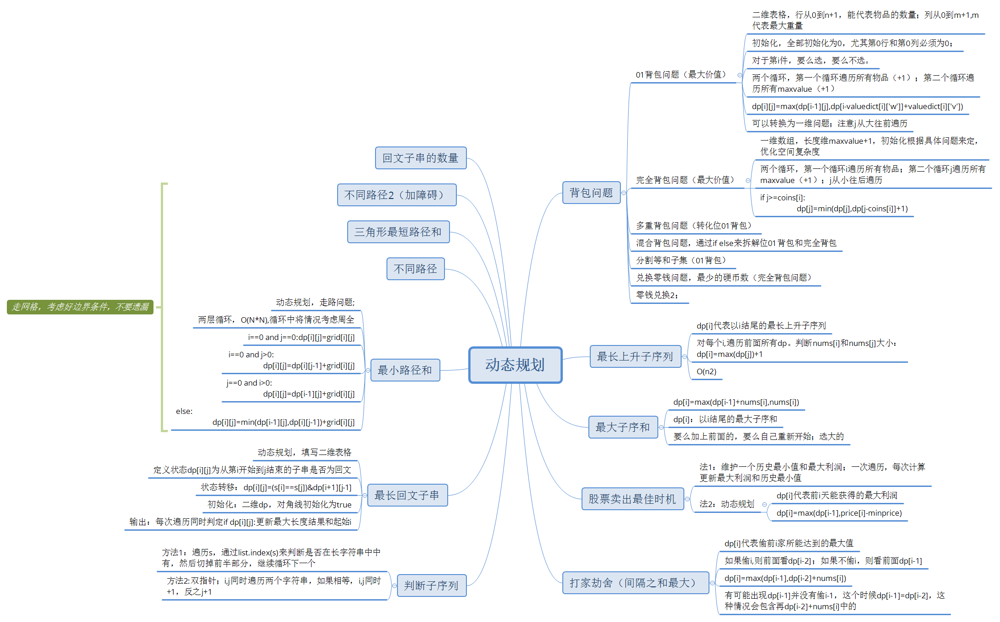
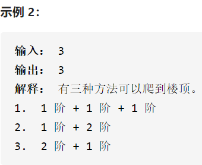

## 爬楼梯



斐波那契数列，可以递归/求通项/动态规划。

动态规划相当于从前往后推里，并只保留递推需要的值，即前两个数值，这样可以减小空间复杂度。

## 买卖股票的最佳时机

> 输入: [7,1,5,3,6,4]
> 输出: 5
> 解释: 在第 2 天（股票价格 = 1）的时候买入，在第 5 天（股票价格 = 6）的时候卖出，最大利润 = 6-1 = 5 。
>      注意利润不能是 7-1 = 6, 因为卖出价格需要大于买入价格；同时，你不能在买入前卖出股票

一次遍历或动态规划。动态规划即维护一个dp[i]列表，保存每一天的最大利润。而一次遍历相当于前者的优化，只保留最低价格，并比较当前卖出的利润是否大于最大利润。

## 最大子序和

```
输入: [-2,1,-3,4,-1,2,1,-5,4]
输出: 6
解释: 连续子数组 [4,-1,2,1] 的和最大，为 6
```

动态规划。 每个dp[i]中保存dp[i-1]与当前元素的和，如果dp[i-1]为负数，则不加上这个值。dp中最大的值就是最大子序和。

`dp[i] = max(dp[i-1], nums[i]);`

## 打家劫舍

>示例 1：
>
>输入：[1,2,3,1]
>输出：4
>解释：偷窃 1 号房屋 (金额 = 1) ，然后偷窃 3 号房屋 (金额 = 3)。
>     偷窃到的最高金额 = 1 + 3 = 4 。

自上而下，动态规划。n所房屋的最高金额等于考虑最后一所房屋要不要偷，若不进去，则与偷前n-1所房屋一致；若进去偷，则与偷前n-2所房屋的最高金额相关。即：

`dp[i] = max(dp[i-1], dp[i-2]+nums[i];`

