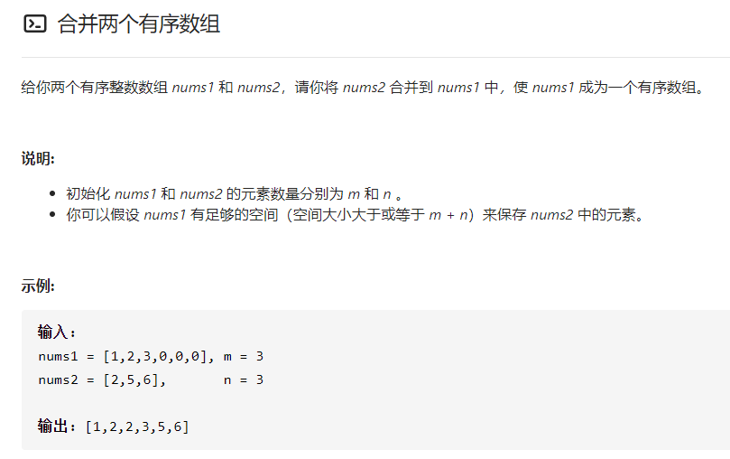
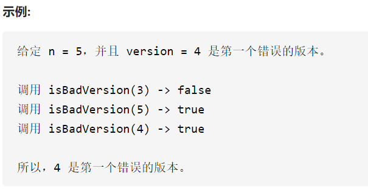

[优秀连接](https://leetcode-cn.com/problems/sort-an-array/solution/python-shi-xian-de-shi-da-jing-dian-pai-xu-suan-fa/)

### 合并两个有序数组

双指针。copy一个nums1内存空间res保存结果。

p<q, 则p值放入res，p++;反之同。退出循环的条件，指针没到末尾

注意：p,q长度不一致，把未排完的依次放入res末尾。

### 第一个错误版本

二分法查找。复杂度o(logn)

初始化边界：left为1，right为n. 

判断中间值：isBadVersion(left+(right-left)/2)

退出循环的条件： left < right