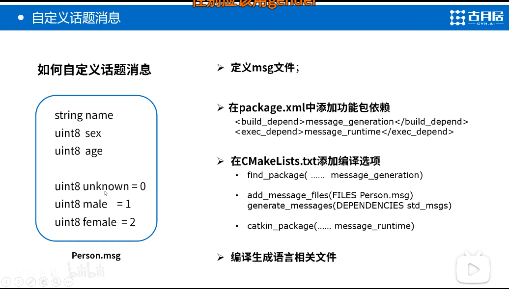

# rosbag

可以采集一些topic数据并发布数据。相当于subscriber和publisher。

```shell
rosbag record /topic_name -o my_rosbag_name
```

record指令后面可以接多个topic名字，`-o`是输出文件名字.

```Shell
rosbag info my_rosbag_name
```

可查看记录的rosbag的信息，包括topic，消息类型，包的大小时长等

```shell
rosbag play my_rosbag_name
```

重新发布记录的包到各自的主题。注意仿真的时间依据，`--clock`可限制为系统时间. `-l`可以循环播放, `-s`可以设置开始播放的时间起点, `-r`可以限制播放的速率

```shell
rostopic echo /topic_name
```

可实时输出topic的内容信息。

```shell
rosbag filter input.bag output.bag "t.to_sec() <= 1284703931.86"
```

上面的命令需要你有inputbag，然后它会把Bag Time<=1284703931.86的部分提取出来，重新放到一个新的ouput.bag里.

# msg

## Header

有一些msg含有header信息，包含了消息的常用的信息。

```
uint32 seq
time stamp
string frame_id
```

## 自定义msg



四个步骤如图所示.

1. `touch Person.msg`新建消息文件，catkin_make的时候会根据系统位数语言等自动生成包含person类的头文件，因此`#include "pakage_name/person_msg.h"`

2. 添加编译运行依赖包：

   ```shell
   <build_depend>message_generation</build_depend>
   <exec_depend>message_runtime</exec_depend>
   ```

3. 修改CMakeLists：

   ```shell
   add_executable(person_publisher src/person_publisher.cpp)
   target_link_libraries(person_publisher ${catkin_LIBRARIES})
   add_dependencies(person_publisher ${PROJECT_NAME}_generate_messages_cpp)
   #与2中相应
   
   add_executable(person_subscriber src/person_subscriber.cpp)
   target_link_libraries(person_subscriber ${catkin_LIBRARIES})
   add_dependencies(person_subscriber ${PROJECT_NAME}_generate_messages_cpp)
   ```

# tf::transform

`#include <tf/tranform_listener.h>`

`#include <tf/transform_broadcaster.h>`

## 广播器Broadcaster

```C++
static tf::TransformBroadcaster bc;

tf::Transform transform;
//set 平移变换
transform.setOrigin(tf::Vector(input_msg.x, input_msg.y, 0.0)); 
//set 旋转变换
tf:: Quaternion q;	//四元素
q.setRPY(0.0，0.0，input_msg.theta);
transform.setRotation(q);

bc.sendTransform(tf::StampedTransform(transform,ros::Time:now(), "world", turtle_name) );
```

## 订阅器listener

```C++
// 创建tf的监听器
tf::TransformListener listener;

ros::Rate rate(10.0);
while (node.ok())
{
    // 获取turtle1与turtle2坐标系之间的tf数据
    tf::StampedTransform transform;
    try
    {
        listener.waitForTransform("/turtle2", "/turtle1", ros::Time(0), ros::Duration(3.0));	//等待消息的到来， duration设置为3s超时
        listener.lookupTransform("/turtle2", "/turtle1", ros::Time(0), transform);
    }
    catch (tf::TransformException &ex) 
    {
        ROS_ERROR("%s",ex.what());
        ros::Duration(1.0).sleep();
        continue;
    }
    
    transform.getOrigin().x();
    transform.getOrigin().y();
    
}
```

## static_transform_publisher节点

```xml
  <!--Calibration-->
  <node pkg="tf" type="static_transform_publisher" name="base_link_to_rslidar_left"  args="-1.249000902703301e-16 0.65 -0.2 0 0.017453293 -0.8203047710000001 /rslidar /rslidar_left 1" required="true" />
  <node pkg="tf" type="static_transform_publisher" name="base_link_to_rslidar_right"  args="2.654126918244515e-16 -0.5250000000000004 -0.2 0 0 0.006981317200000003 /rslidar /rslidar_right 1" required="true" />
```

上面的代码是我们在launch文件中将两侧雷达的数据坐标变换到中间雷达中运行的两个节点。`tf::static_transform_publisher`

```shell
rosrun tf static_transform_publisher 
```

可通过上述指令查看该节点需要的参数的顺序，如下：

>Usage: static_transform_publisher *x y z yaw pitch roll frame_id child_frame_id  period*(milliseconds) 
>OR 
>Usage: static_transform_publisher *x y z qx qy qz qw frame_id child_frame_id  period*(milliseconds) 

