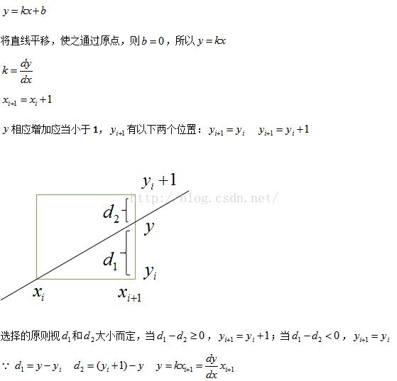
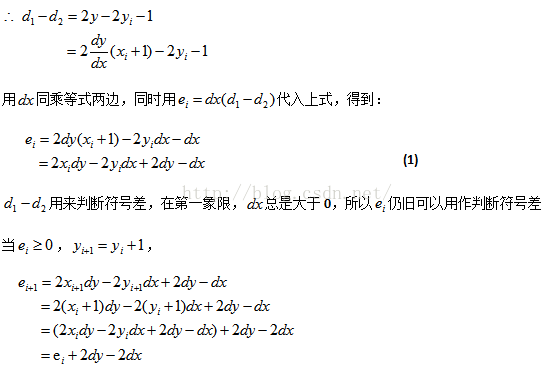
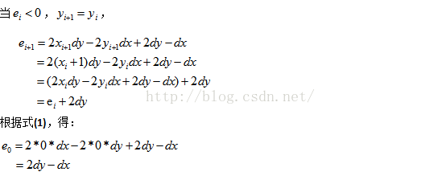
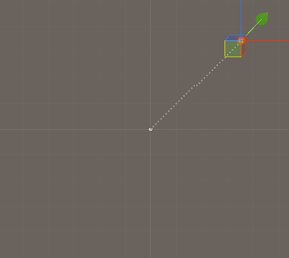

[转载自](http://www.idivecat.com/archives/652)

# 原理







# 算法演变为程序的实现思路：

1.起点x1,y1 终点x2.y2
2.初始值x=x1,y=y1
3.起点和终点在xy轴的差值dx=x2-x1,dy=y2-y1
4.初始误差判别式 p=2dy-dx
5.循环实现直线生成，每个i的计算过程中
如果判别式p>=0时，则下一个p=p+2dy-2dx
如果判别式p<0时，则下一个p=p+2dy

代码如下（可优化细节，这里为了加深印象就保持和算法公式一模一样）:

```C++
using System.Collections;
using System.Collections.Generic;
using UnityEngine;

public class Line : MonoBehaviour
 {
    public Transform m_startObj;
    public Transform m_endObj;
    private List<Vector2> m_listLine = new List<Vector2>();

    void Update ()
    {
        Vector3 startPos = m_startObj.localPosition;
        Vector3 endPos = m_endObj.localPosition;
        LinePath((int)startPos.x, (int)startPos.z,
        (int)endPos.x, (int)endPos.z, ref m_listLine);
    }

    private void LinePath(int x1, int y1, int x2, int y2, ref List<Vector2> linePath)
    {
        // 起点
        int x = x1;
        int y = y1;
        // xy差值
        int dx = x2 - x1;      
        int dy = y2 - y1;
        // 单位增量
        int ux = (dx > 0) ? 1 : -1;
        int uy = (dy > 0) ? 1 : -1;
        // 差值取绝对值
        dx = Mathf.Abs(dx);
        dy = Mathf.Abs(dy);
        // 遍历生成直线点，以较长的轴向累加
        if(dx > dy)
        {
            // 初始判别式
            int p = 2 * dy - dx;
            for(int i = 0; i <= dx; i ++)
            {
                linePath.Add(new Vector2(x, y));
                x += ux;
                if(p >= 0)
                {
                    y += uy;
                    p += 2 * (dy - dx);
                }
                else
                {
                    p += 2 * dy;
                }
            }
        }
        else
        {
            int p = 2 * dx - dy;
            for(int i = 0; i <= dy; i ++)
            {
                linePath.Add(new Vector2(x, y));
                y += uy;
                if(p >= 0)
                {
                    x += ux;
                    p += 2 * (dx - dy);
                }
                else
                {
                    p += 2 * dx;
                }
            }
        }
    }

    public void OnDrawGizmos()
    {
        for(int i = 0; i < m_listLine.Count; i ++)
        {
            Vector3 pos = new Vector3(m_listLine[i].x, 0 , m_listLine[i].y);
            Gizmos.DrawSphere(pos, 0.4f);
        }
    }
}
```


运行如下图：

