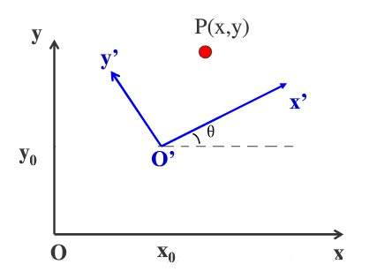
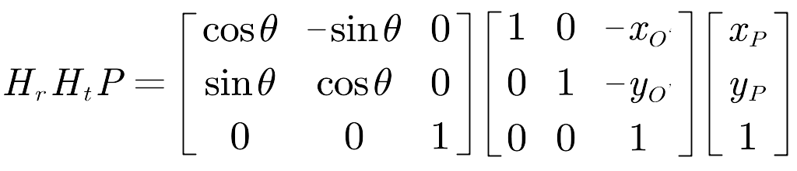

# 坐标变换

要获取原坐标系O下P点在新坐标系O’下的新坐标（点不动，坐标系懂）。需要三个条件：(观察角度：移动坐标系轴O到新坐标轴O'，先平移再旋转，得到P在新坐标系O’中的坐标)

- O’在O中的坐标(x’,y’)：坐标系正向移动，P点坐标变小，所以平移矩阵符号相反

- P在O中的坐标(x,y)：自变量，状态向量
- 旋转角度：*逆时针为负，顺时针为正*，也好理解，与通常相反，因为正向移动坐标系，点的角度变小。

通常采用左乘。

