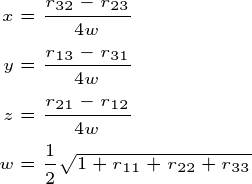
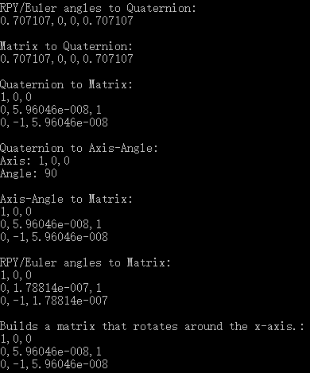

# 旋转基础

转载链接：https://www.cnblogs.com/21207-iHome/p/6894128.html

## **RPY角与Z-Y-X欧拉角**

　　描述坐标系{B}相对于参考坐标系{A}的姿态有两种方式。第一种是**绕固定（参考）坐标轴旋转**：假设开始两个坐标系重合，先将{B}绕{A}的X轴旋转$\lambda$，然后绕{A}的Y轴旋转 $\beta$ ，最后绕{A}的Z轴旋转$\alpha$，就能旋转到当前姿态。可以称其为X-Y-Z fixed angles或RPY角(Roll, Pitch, Yaw)。

Roll:横滚


　　Pitch: 俯仰


Yaw: 偏航（航向）


由于是绕固定坐标系旋转，则旋转矩阵为（$c\alpha$ is shorthand for $\cos\alpha$, $s\alpha$ is shorthand for $\sin\alpha$,and so on.）
$$
R_{XYZ}(\gamma,\beta,\alpha)=R_Z(\alpha)R_Y(\beta)R_X(\gamma)=\begin{bmatrix}
c\alpha c\beta & c\alpha s\beta s\gamma-s\alpha c\gamma & c\alpha s\beta c\gamma+s\alpha s\gamma\\
s\alpha c\beta & s\alpha s\beta s\gamma+c\alpha c\gamma & s\alpha s\beta c\gamma-c\alpha s\gamma\\
-s\beta& c\beta s\gamma & c\beta c\gamma
\end{bmatrix}
$$
　　另一种姿态描述方式是**绕自身坐标轴旋转**：假设开始两个坐标系重合，先将{B}绕自身的Z轴旋转$\alpha$，然后绕Y轴旋转$\beta$，最后绕X轴旋转$\gamma$，就能旋转到当前姿态。称其为Z-Y-X欧拉角，由于是绕自身坐标轴进行旋转，则旋转矩阵为：
$$
R_{Z'Y'X'}(\alpha,\beta,\gamma)=R_Z(\alpha)R_Y(\beta)R_X(\gamma)=\begin{bmatrix}
c\alpha c\beta & c\alpha s\beta s\gamma-s\alpha c\gamma & c\alpha s\beta c\gamma+s\alpha s\gamma\\
s\alpha c\beta & s\alpha s\beta s\gamma+c\alpha c\gamma & s\alpha s\beta c\gamma-c\alpha s\gamma\\
-s\beta& c\beta s\gamma & c\beta c\gamma
\end{bmatrix}
$$
　　可以发现这两种描述方式得到的旋转矩阵是一样的，即绕固定坐标轴X-Y-Z旋转$(\gamma,\beta,\alpha)$和绕自身坐标轴Z-Y-X旋转$(\alpha,\beta,\gamma)$的最终结果一样，只是描述的方法有差别而已。In gerenal: three rotations taken about fixed axes yield the same final orientation as the same three rotations taken in opposite order about the axes of the moving frame.

## **Axis-Angle与四元数**

　　绕坐标轴的多次旋转可以等效为绕某一转轴旋转一定的角度。假设等效旋转轴方向向量为$\vec{K}=[k_x,k_y,k_z]^T$，等效旋转角为$\theta$，则四元数$q=(x,y,z,w)$，其中：

$$\begin{align*}
x &= k_x \cdot sin \frac{\theta}{2}\\
y &= k_y \cdot sin \frac{\theta}{2}\\
z &= k_z \cdot sin \frac{\theta}{2}\\
w &= cos \frac{\theta}{2}
\end{align*}$$

　　且有$x^2+y^2+z^2+w^2=1$


　　即四元数存储了旋转轴和旋转角的信息，它能方便的描述刚体绕任意轴的旋转。

　　四元数转换为旋转矩阵：

$$R=\begin{bmatrix}
1-2y^2-2z^2 & 2(xy-zw) & 2(xz+yw)\\
2(xy+zw) & 1-2x^2-2z^2 & 2(yz-xw)\\
2(xz-yw)& 2(yz+xw) & 1-2x^2-2y^2
\end{bmatrix}$$

 　已知旋转矩阵为：


　　则对应的四元数为：



 

------

## **四元数与欧拉角的相互转换**

　　定义两个四元数：

　　

　　

　　其中 表示矢量 

 

 ；而 

 

 表示矢量 

 

**四元数加法：**

　　跟复数、向量和矩阵一样，两个四元数之和需要将不同的元素加起来。


　　加法遵循实数和复数的所有交换律和结合律。

**四元数乘法：**

　　四元数的乘法的意义类似于矩阵的乘法，可以表示旋转的合成。当有多次旋转操作时，使用四元数可以获得更高的计算效率。


　　由于四元数乘法的非可换性，pq并不等于qp，qp乘积的向量部分是：


　　

　　Mathematica中有四元数相关的程序包[**Quaternions Package**](https://reference.wolfram.com/language/Quaternions/tutorial/Quaternions.html)，需要先导入才能使用。下面计算了三个四元数的乘积：

```
<<Quaternions`     （* This loads the package *）
Quaternion[2, 1, 1, 3] ** Quaternion[2, 1, 1, 0] ** Quaternion[1, 1, 1, 1]    (* Be sure to use ** rather than * when multiplying quaternions *)
```

　　计算结果为：Quaternion[-12, 4, 14, 2]

 

　　那么将Z-Y-X欧拉角（或RPY角：绕固定坐标系的X-Y-Z依次旋转$\alpha$,$\beta$,$\gamma$角）转换为四元数：

$$q=\begin{bmatrix}\cos\frac{\gamma}{2}\\ 0\\ 0\\ \sin\frac{\gamma}{2}\end{bmatrix} \begin{bmatrix}\cos\frac{\beta}{2}\\ 0\\ \sin\frac{\beta}{2}\\ 0\end{bmatrix} \begin{bmatrix}\cos\frac{\alpha}{2}\\ \sin \frac{\alpha}{2}\\ 0\\ 0\end{bmatrix}=\begin{bmatrix}
\cos\frac{\alpha}{2}\cos\frac{\beta}{2}\cos\frac{\gamma}{2}+\sin\frac{\alpha}{2}\sin\frac{\beta}{2}\sin\frac{\gamma}{2}\\
\sin\frac{\alpha}{2}\cos\frac{\beta}{2}\cos\frac{\gamma}{2}-\cos\frac{\alpha}{2}\sin\frac{\beta}{2}\sin\frac{\gamma}{2}\\ \cos\frac{\alpha}{2}\sin\frac{\beta}{2}\cos\frac{\gamma}{2}+\sin\frac{\alpha}{2}\cos\frac{\beta}{2}\sin\frac{\gamma}{2}
\\ \cos\frac{\alpha}{2}\cos\frac{\beta}{2}\sin\frac{\gamma}{2}-\sin\frac{\alpha}{2}\sin\frac{\beta}{2}\cos\frac{\gamma}{2}
\end{bmatrix}$$

 　根据上面的公式可以求出逆解，即由四元数$q=(q_0,q_1,q_2,q_3)$或$q=(w,x,y,z)$到欧拉角的转换为：

$$\begin{bmatrix}\alpha\\ \beta\\ \gamma\end{bmatrix} = \begin{bmatrix}
\arctan\frac{2(q_0q_1+q_2q_3)}{1-2(q_1^2+q_2^2)}\\
\arcsin(2(q_0q_2-q_1q_3))\\
\arctan\frac{2(q_0q_3+q_1q_2)}{1-2(q_2^2+q_3^2)}
\end{bmatrix}$$

　　由于arctan和arcsin的取值范围在$\frac{-\pi}{2}$和$\frac{\pi}{2}$之间，只有180°，而绕某个轴旋转时范围是360°，因此要使用**[atan2](http://baike.baidu.com/link?url=-tnNm1Iop3YKgo3EKf4OpaAPSC6KsyMS3trChz3oL3fsTTqFsXt8Y6oX_anPYoMa8EO9tJ7eSRnK1LiuFF4Jma)**函数代替arctan函数：

$$\begin{bmatrix}\alpha\\ \beta\\ \gamma\end{bmatrix} = \begin{bmatrix}
atan2(2(q_0q_1+q_2q_3),1-2(q_1^2+q_2^2))\\
\arcsin(2(q_0q_2-q_1q_3))\\
atan2(2(q_0 q_3+q_1 q_2),1-2(q_2^2+q_3^2))
\end{bmatrix}$$

对于tan(θ) = y / x ：

　　θ = ATan(y / x)求出的θ取值范围是[-PI/2, PI/2]；

　　θ = ATan2(y, x)求出的θ取值范围是[-PI,  PI]。

- 当 (x, y) 在第一象限, 0 < θ < PI/2
- 当 (x, y) 在第二象限 PI/2 < θ≤PI
- 当 (x, y) 在第三象限, -PI < θ < -PI/2
- 当 (x, y) 在第四象限, -PI/2 < θ < 0

 　将[四元数转换为欧拉角](http://bediyap.com/programming/convert-quaternion-to-euler-rotations/)可以参考下面的代码。需要注意**欧拉角有12种旋转次序**，而上面推导的公式是按照Z-Y-X顺序进行的，所以有时会在网上看到不同的转换公式（因为对应着不同的旋转次序），在使用时一定要注意旋转次序是什么。比如ADAMS软件里就默认Body 3-1-3次序，即Z-X-Z欧拉角，而VREP中则按照X-Y-Z欧拉角旋转。

```
enum RotSeq{zyx, zyz, zxy, zxz, yxz, yxy, yzx, yzy, xyz, xyx, xzy,xzx};
```

 View Code

　　 上面的代码存在一个问题，即奇异性没有考虑。下面看一种特殊的情况（参考[Maths - Conversion Quaternion to Euler](http://www.euclideanspace.com/maths/geometry/rotations/conversions/quaternionToEuler/index.htm)）：假设一架飞机绕Y轴旋转了90°（俯仰角pitch=90），机头垂直向上，此时如何计算航向角和横滚角？


　　这时会发生自由度丢失的情况，即Yaw和Roll会变为一个自由度。此时再使用上面的公式根据四元数计算欧拉角会出现问题：

　　$\arcsin(2(q_0q_2-q_1q_3))$的定义域为$[-1,1]$，因此$(q_0q_2-q_1q_3)\in[-0.5, 0.5]$，当$q_0q_2-q_1q_3=0.5$时（在程序中浮点数不能直接进行等于判断，要使用合理的阈值），俯仰角$\beta$为90°，将其带入正向公式计算出四元数$(q_0,q_1,q_2,q_3)$，然后可以发现逆向公式中atan2函数中的参数全部为0，即出现了$\frac{0}{0}$的情况！无法计算。

　　$\beta=\pi/2$时，$\sin\frac{\beta}{2}=\cos\frac{\beta}{2}=0.707$，将其带入公式中有

$$q=\begin{bmatrix}w\\ x\\ y\\ z\end{bmatrix}
\begin{bmatrix}
0.707(\cos\frac{\alpha}{2}\cos\frac{\gamma}{2}+\sin\frac{\alpha}{2}\sin\frac{\gamma}{2})\\
0.707(\sin\frac{\alpha}{2}\cos\frac{\gamma}{2}-\cos\frac{\alpha}{2}\sin\frac{\gamma}{2})\\
0.707(\cos\frac{\alpha}{2}\cos\frac{\gamma}{2}+\sin\frac{\alpha}{2}\sin\frac{\gamma}{2})\\
0.707(\cos\frac{\alpha}{2}\sin\frac{\gamma}{2}-\sin\frac{\alpha}{2}\cos\frac{\gamma}{2})
\end{bmatrix}=
\begin{bmatrix}
0.707\cos\frac{\alpha-\gamma}{2}\\
0.707\sin\frac{\alpha-\gamma}{2}\\
0.707\cos\frac{\alpha-\gamma}{2}\\
0.707\sin\frac{\alpha-\gamma}{2}
\end{bmatrix}$$

　　则$\frac{x}{w}=\frac{z}{y}=\tan\frac{\alpha-\gamma}{2}$，于是有

$$\alpha-\gamma = 2\cdot atan2(x,w)$$

 　通常令$\alpha=0$，这时$\gamma = -2\cdot atan2(x,w)$。可以进行验证：当四元数为(w,x,y,z)=(0.653,-0.271,0.653,0.271)时，根据这些规则计算出来的ZYX欧拉角为α=0°，β=90°，γ=45°

[](http://quaternions.online/)

　　当俯仰角为-90°，即机头竖直向下时的情况也与之类似，可以推导出奇异姿态时的计算公式。比较完整的四元数转欧拉角（Z-Y-X order）的代码如下：

```
CameraSpacePoint QuaternionToEuler(Vector4 q) // Z-Y-X Euler angles
{
    CameraSpacePoint euler = { 0 };
    const double Epsilon = 0.0009765625f;
    const double Threshold = 0.5f - Epsilon;

    double TEST = q.w*q.y - q.x*q.z;

    if (TEST < -Threshold || TEST > Threshold) // 奇异姿态,俯仰角为±90°
    {
        int sign = Sign(TEST);

        euler.Z = -2 * sign * (double)atan2(q.x, q.w); // yaw

        euler.Y = sign * (PI / 2.0); // pitch

        euler.X = 0; // roll

    }
    else
    {
        euler.X = atan2(2 * (q.y*q.z + q.w*q.x), q.w*q.w - q.x*q.x - q.y*q.y + q.z*q.z);
        euler.Y = asin(-2 * (q.x*q.z - q.w*q.y));
        euler.Z = atan2(2 * (q.x*q.y + q.w*q.z), q.w*q.w + q.x*q.x - q.y*q.y - q.z*q.z);
    }
        
    return euler;
}
```

 

------

　　在DirectXMath Library中有许多与刚体姿态变换相关的函数可以直接调用：

- 四元数乘法：[XMQuaternionMultiply](https://msdn.microsoft.com/en-us/library/windows/desktop/microsoft.directx_sdk.quaternion.xmquaternionmultiply(v=vs.85).aspx) method --Computes the product of two quaternions.
- 旋转矩阵转四元数：[XMQuaternionRotationMatrix](https://msdn.microsoft.com/en-us/library/windows/desktop/microsoft.directx_sdk.quaternion.xmquaternionrotationmatrix(v=vs.85).aspx) method --Computes a rotation quaternion from a rotation matrix.
- 四元数转旋转矩阵：[XMMatrixRotationQuaternion](https://msdn.microsoft.com/en-us/library/windows/desktop/microsoft.directx_sdk.matrix.xmmatrixrotationquaternion(v=vs.85).aspx) method -- Builds a rotation matrix from a quaternion.
- 欧拉角转四元数：[XMQuaternionRotationRollPitchYaw](https://msdn.microsoft.com/en-us/library/windows/desktop/microsoft.directx_sdk.quaternion.xmquaternionrotationrollpitchyaw(v=vs.85).aspx) method --Computes a rotation quaternion based on the pitch, yaw, and roll (Euler angles).
- 四元数转Axis-Angle：[XMQuaternionToAxisAngle](https://msdn.microsoft.com/en-us/library/windows/desktop/microsoft.directx_sdk.quaternion.xmquaterniontoaxisangle(v=vs.85).aspx) method --Computes an axis and angle of rotation about that axis for a given quaternion.
- 欧拉角转旋转矩阵：[XMMatrixRotationRollPitchYaw method](https://msdn.microsoft.com/en-us/library/windows/desktop/microsoft.directx_sdk.matrix.xmmatrixrotationrollpitchyaw(v=vs.85).aspx) --Builds a rotation matrix based on a given pitch, yaw, and roll (Euler angles).
- Axis-Angle转旋转矩阵：[XMMatrixRotationAxis](https://msdn.microsoft.com/en-us/library/windows/desktop/microsoft.directx_sdk.matrix.xmmatrixrotationaxis(v=vs.85).aspx) method --Builds a matrix that rotates around an arbitrary axis.
- 构造绕X/Y/Z轴的旋转矩阵：[XMMatrixRotationX](https://msdn.microsoft.com/en-us/library/windows/desktop/microsoft.directx_sdk.matrix.xmmatrixrotationx(v=vs.85).aspx?f=255&MSPPError=-2147217396) method --Builds a matrix that rotates around the x-axis.(Angles are measured clockwise when looking along the rotation axis toward the origin)

 　下面的代码中坐标系绕X轴旋转90°（注意这里不是按照右手定则的方向，而是沿着坐标轴向原点看过去以顺时针方式旋转，因此与传统的右手定则刚好方向相反），来进行变换：

 View Code

　　结果如下图所示:



 

参考：

[quaternions.online](http://quaternions.online/)

[DirectXMath Library Quaternion Functions](https://msdn.microsoft.com/en-us/library/windows/desktop/ee415597(v=vs.85).aspx)

[Convert quaternion to euler rotations](http://bediyap.com/programming/convert-quaternion-to-euler-rotations/)

[Conversion between quaternions and Euler angles](https://en.wikipedia.org/wiki/Conversion_between_quaternions_and_Euler_angles)

[Maths - Conversion Quaternion to Euler](http://www.euclideanspace.com/maths/geometry/rotations/conversions/quaternionToEuler/index.htm)

**[Coordinate Transformations in Robotics—MATLAB](http://cn.mathworks.com/help/robotics/gs/coordinate-systems-in-robotics.html)**

***Introduction to Robotics - Mechanics and Control.*** Chapter 2 Spatial descriptions and transformations