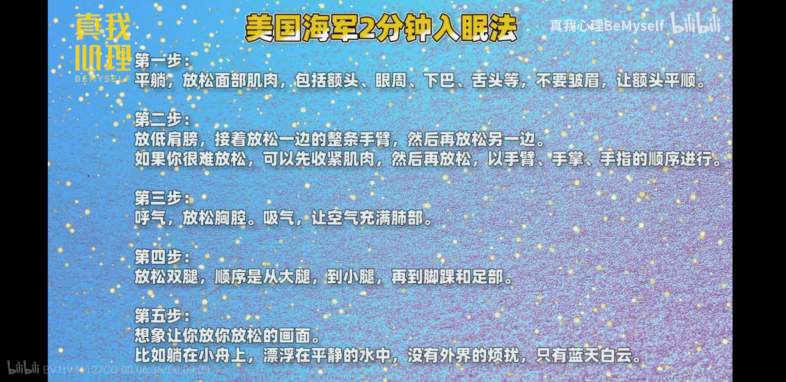

总结自B站视频[**R90高效睡眠法**](https://www.bilibili.com/video/BV1tV41127CQ?t=449)

# 固定作息时间

> - 通常起床时间比进入工作状态时刻提前90min,或者1h也行. 
> - 然后倒推5个睡眠周期即7.5h推导出大致应睡着的时间.
> - 然后睡前一小时开始准备入睡。 

按照上述公式，

| 9点进入工作   | 7点30~8点起床  | 0点～0点30睡着 | 23点～23点30准备入睡 |
| ------------- | -------------- | -------------- | -------------------- |
| 9点半进入工作 | 8点～8点30起床 | 0点30～1点睡着 | 23点30~12点准备入睡  |

鉴于室友生活作息,12点半之前才能熄灯睡觉. 因此我反其道为之推导起床工作时间。

晚上**0点30之前**关掉手机和音乐酝酿睡觉。 **8点和8点15**起床铃铛

# 做好前戏

## 缩减体表体内温差

- 睡前洗澡
- **睡前泡脚**
- 舒缓运动

睡前一小时进行。**23点30**

## 避免手机蓝光

12点放下手机,或者看kindle

## 放松身心

- 看无聊的书

- 冥想

- **美国海军2分钟入眠**

  

- 睡前在日记本上把所有想法捋捋清楚

## 调整睡姿

**侧卧**: 保证脊椎,颈椎和屁股在一条线上.

**平躺**: 感受每个部位的受力,假装自己死掉啦

# 布置睡觉环境

- 温度16~18℃. 凉爽通风. *無理だよ無理だよ*

- 简单, 避光, 隔音. *無理だよ*
- 床垫和枕头