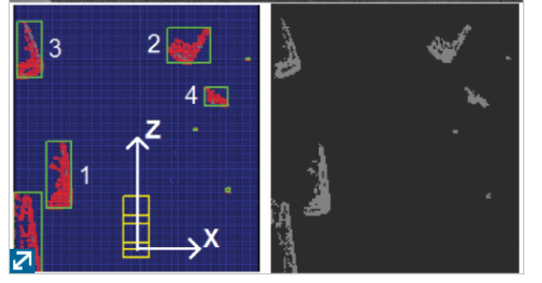
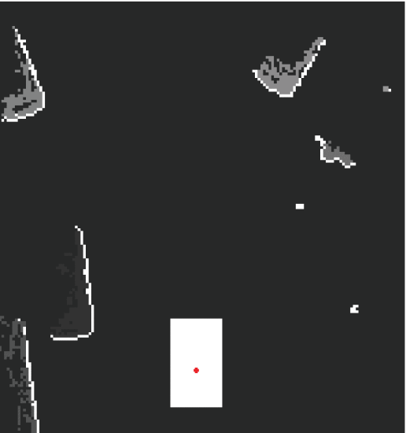
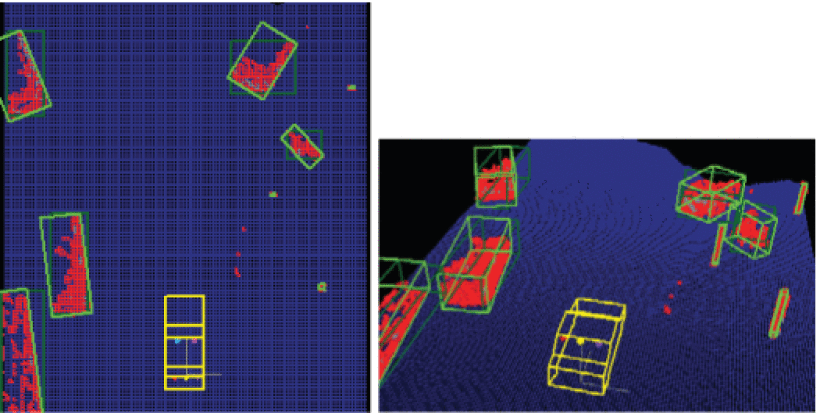
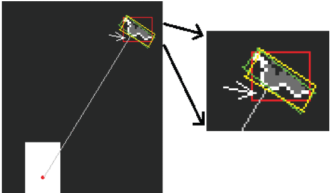
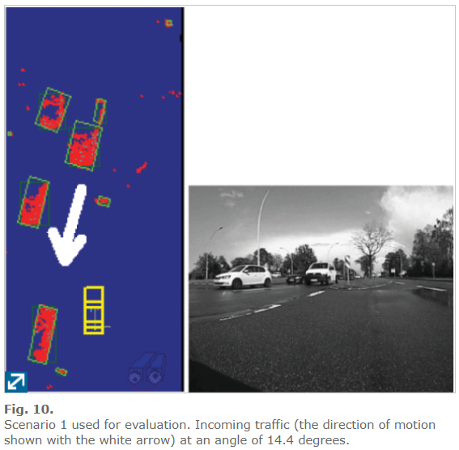
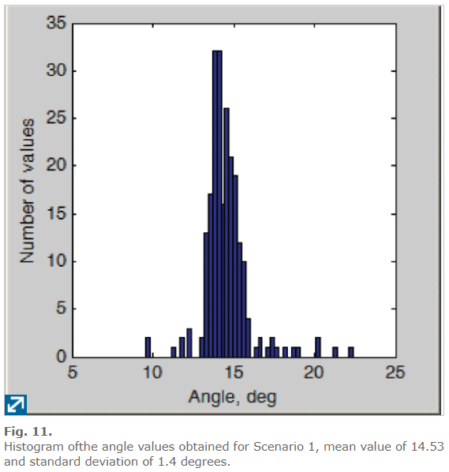
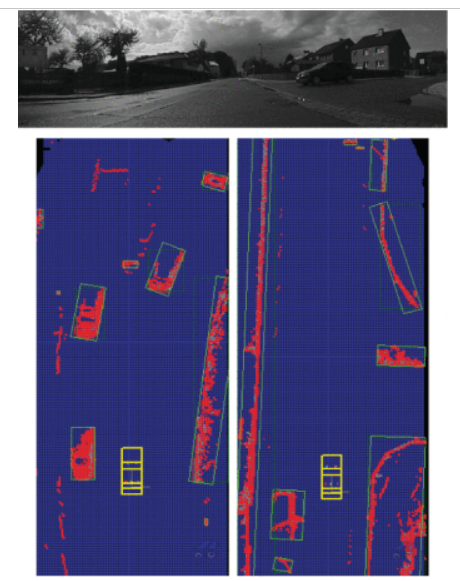

# [A Fast Ransac Based Approach for Computing the Orientation of Obstacles in Traffic Scenes 2018 ICCP](https://ieeexplore.ieee.org/abstract/document/8516642)
## 摘抄

>“最近，作为普通的1、2、4层和昂贵的64层激光雷达之间的中间解决方案，引入了16层或32层激光雷达传感器。"

>D. Kim et al., "L-shape model switching-based precise motion tracking of moving vehicles using laser scanners", IEEE Transactions on Intelligent Transportation Systems, vol. 19, no. 2, pp. 598-612, 2018.
依赖线束结构顺序L形状拟合，但是跟踪部分值得看“Tracking is further employed to smooth the results and to estimate dynamic features. ”
The rectangle fit is preferred if available. Tracking is then used for temporal filtering and smoothing.

> X. Shen, S. Pendleton, M. H. Ang, "Efficient L-shape fitting of laser scanner data for vehicle pose estimation", IEEE Conference on Robotics Automation and Mechatronics, pp. 173-178, 2015.
群集中的每个点都被视为枢轴（两条线的公共点），并且找到了最佳的一对线。
>将要提出的方法不需要点的原始扫描顺序，也不需要分别为计算方向而对每个激光雷达层进行处理。因此，这是一种更通用的方法，适用于多层激光雷达

## 主要贡献
1. 低复杂度
2. RANSAC拟合到直角模型
3. 占据面积准则选择最佳方向
## 算法流程

1. 输入，占据栅格图10cm检测障碍物ABB的框（绿色）
2. “可见边界”概念提出。
	就是将边缘点提取出来，利用射线追踪检查得到可见边界
		
3. 拟合垂直线模型RANSAC
	将提取出来的边界点拟合直线L1，再利用RANSAC选择其余点拟合L2
	
4. 根据RANSAC的评分和未占据栅格的面积准则评估和验证最优方向
	在第一条线L的内部数上设置一个小的绝对阈值（= 8个像元），所以不适用于鸟瞰图小的物体。
	考虑只能观测到障碍物的一条边时的两种情况：
a. 该边具有很好的方向性，如建筑物/大车一边
		解决办法：设定ransac拟合评分（即inlier的数目）阈值，大于这个阈值认为可靠度高。阈值的设定应当能够区别开车头的曲线和车辆侧方。
b. 该边不能很好的拟合，如小车车头
		解决：当主方向线拟合的评分小于阈值，考虑次方向线的评分。若次方向依然不满足要求，则可以采取两个办法：①时间域跟踪滤波②根据拟合的框/ABB/视线方向框三者中未占据栅格的面积最小来选择最佳的主方向。

## 主要结果
**时间：**
本方法：C++2.5GHz，0.2ms.
Lshape: C++ 1.6ms
**方向精度：**
选择了几个场景进行评估，第一个场景手动依据点云路沿估计真值。第二个场景在直的路上采的，默认真值为0°。
			

不足：
在近观测到车头和车尾情况下精度在4~6°，此外由于长方形拟合的局限性，对弯曲的栅栏等障碍物就不再适用。此时可以利用文献分享的西安交通大学的方法。

## 思考
	1. 占据栅格？or点云？-->精度？or实时性？
	2. 仅栅格聚类？or栅格拟合？
	3. 这篇文章同我目前的预研究最为贴切，值得深思
	4. 所有场景配备视频资料，很信服。
	5. 利用跟踪进行部分误差修正。

# [An Orientation Corrected Bounding Box Fit Based on the Convex Hull under Real Time Constraints](https://ieeexplore.ieee.org/abstract/document/8500692/authors#authors)
## 摘抄
>基于点云的MODT问题经典处理思路是：
	1. 地面和障碍物分离
	2. 不同障碍物分割成类
	3. 簇拟合形状获取尺寸和位置信息
	4. 状态估计滤波器
>Lshape的相关工作总结的挺好

>P. Kmiotek and Y. Ruichek, “Representing and Tracking of Dynamics
Objects using Oriented Bounding Box and Extended Kalman Filter,”
in Proc. IEEE Intelligent Transportation Syst. Conf. (ITSC), 2008

## 主要贡献：
1. foucus on runtime
2. 从凸包方法得到的点云加上旋转框（rotating calipers）得到初步的最小面积矩形。然后用了几种方法去做修正。
数学公式有点多解释又不清晰，感觉原理应该不难，就是故意整一堆数学模型复杂化又不说清楚。不想看了。

# [Tracking of Moving Objects from a Moving Vehicle Using a Scanning Laser Rangefinder](https://ieeexplore.ieee.org/document/1706758?arnumber=1706758&tag=1)

## 摘抄
>跟踪的主要步骤是：分割，特征提取，数据关联，卡尔曼滤波和跟踪验证
“在 [16] 中，采用加权最小二乘法去除离群点，将不完整的轮廓拟合到矩形模型中。考虑到遮挡问题，在 [16] 中同时进行了线拟合和直角角拟合，只有当角拟合明显好于线拟合时，才选择角拟合。”

>试拟合后，最差的20％的点将被丢弃。我们还对密集采样的区域（由于距离扫描仪较近）减轻了点的权重。
>The scanner can see at most two sides of the rectangle,
>尝试将对象中心用作参考点被证明是徒劳的，因为很少能直接测量中心。

## 思考
提到一些用于跟踪的卡尔曼滤波的方法值得参考：
	1. 用跟踪解决雷达稀疏效应造成的过分割和无效点，以及近处遮挡造成的分块
	2. 将噪声分成两部分：静态噪声和自适应噪声，分别由于硬件限制和分割拟合算法造成。**其中自适应噪声用了前15次测量的预测值和观测值之间的残差的协方差矩阵作为噪音矩阵，再加上静态噪声的倍数确保下限。**每次误差中心偏离零值过多再利用观测值重置。
