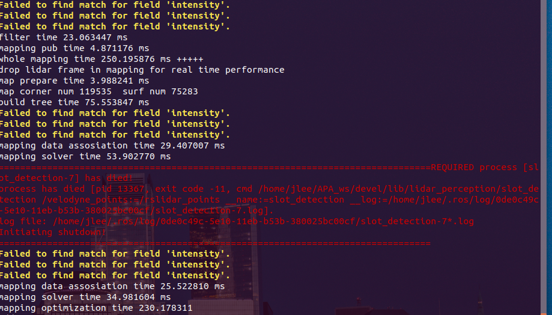

# Kvaser

https://github.com/astuff/kvaser_interface

```yaml
<?xml version="1.0"?>
<launch>
  <arg name="can_hardware_id" default="011683" />
  <!-- <arg name="can_circuit_id" default="2" /> -->
  <arg name="can_bit_rate" default="500000" />

  <node pkg="kvaser_interface" type="kvaser_can_bridge" ns="kvaser_channel_1" name="kvaser_can_bridge" output="screen">
    <param name="can_hardware_id" value="$(arg can_hardware_id)" />
    <param name="can_circuit_id" value="1" />
    <param name="can_bit_rate" value="$(arg can_bit_rate)" />
  </node>

  <node pkg="kvaser_interface" type="kvaser_can_bridge" ns="kvaser_channel_2" name="kvaser_can_bridge" output="screen">
    <param name="can_hardware_id" value="$(arg can_hardware_id)" />
    <param name="can_circuit_id" value="2" />
    <param name="can_bit_rate" value="$(arg can_bit_rate)" />
  </node>
</launch>

```

# 采集数据

1. kvaser 正确链接，接口：
   - CHANEL 2 接 诊断口2  RT3000数据
   - CHANEL 3 接 诊断口4  V3上电和VCU读码盘转向盘数据
2. 上电，matlab/ros驱动
   - *matlab*仿真时间要调成真实时间，上电的时候断开紧急开关（按下）
   - ros驱动指令如下
   - *todo问题*：roskvaser_powerUp没用
3. 连接以太网线和路由器
   - 交换机供电5v，——分线器可能电压不够，利用充电宝或者工控机
4. 连接RT3000和千寻服务
   - 当精度热机到要求的时候开始记录
5. 启动算法
6. 录包
   - 点云没有记录下来

```shell
#kvaser驱动
roslaunch kvaser_interface kvaser_can_bridge.launch

#控制v3上电程序
rosrun lidar_percetion powerUp -i -m -d -g

rosrun lidar_percetion kvaser_powerUp -i -m -d -g

#雷达驱动
roslaunch rslidar_sdk start.launch/start_three.launch

# 感知算法
roslaunch lidar_perception SLAM_and_Detection.launch

#record
rosbag record  /chasis_speed /rt3000_pose /steering_angle_deg /rslidar_points /left/rslidar_points /right/rslidar_points /wheeling_count_fl_fr_rl_rr
```



运行一会会自动关闭

## 问题记录

1. matplotlib 画图figure空白

echo 3 > /proc/sys/vm/drop_caches 

echo $ DISPLAY=0.0

