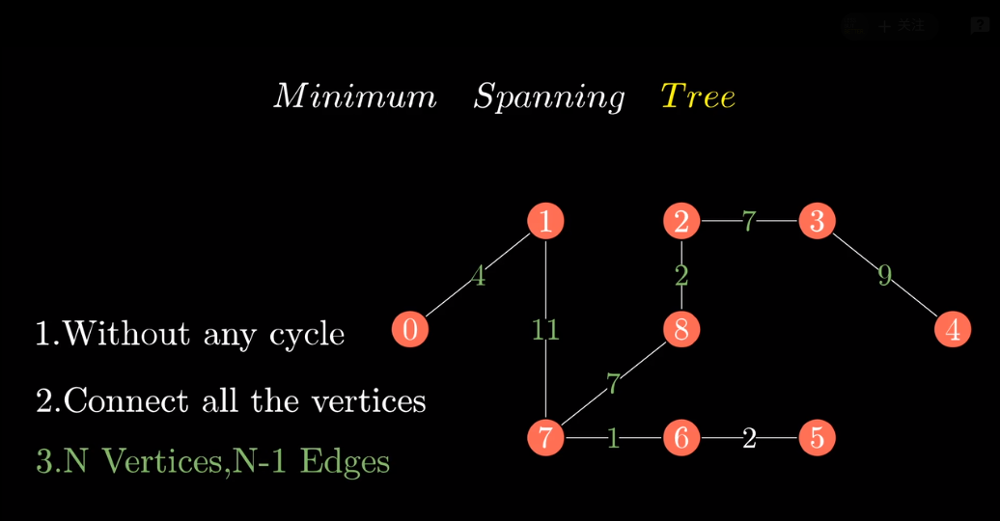
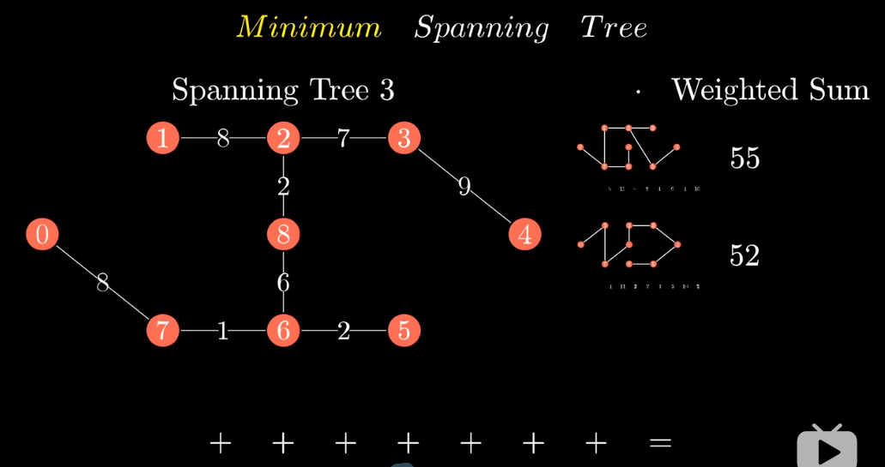
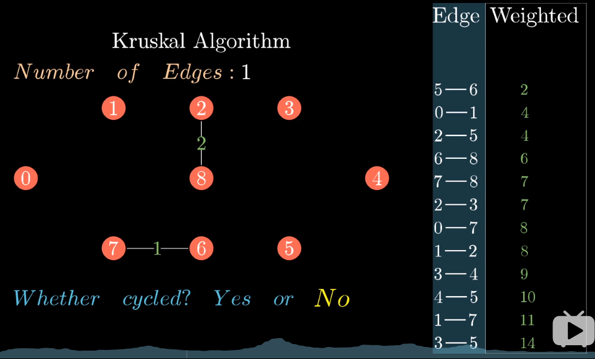
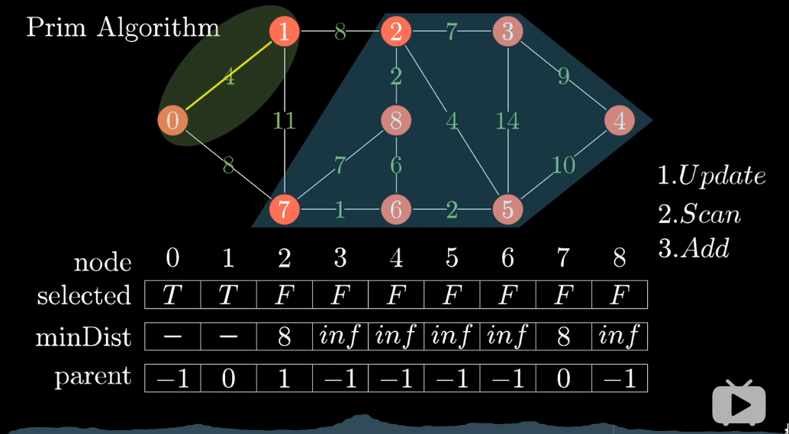

# 最小生成树

参考视频链接: https://www.bilibili.com/video/BV1Eb41177d1?from=search&seid=6207310363940342792

## 概念

树的三个特点, n个点至少需要n-1条边, 不能由环的出现

最小的概念: 每条边都有相应的权重(可以是成本,距离等度量), 树中所有边的权重之和最小的方案为MST

<!-- more -->

## 实现方法

有两种方法: Prime(寻找顶点) 和Kruskal(直接寻找边)

### Kruskal

- 先将所有边按权重排序成列表
- 然后优先放入每条边判断是否成环
- 没有成环则加入MST; 若成环则放弃该边.

### Prim

以顶点为出发点, 每次选择两个集合(已选点集和未选点集)之间边权重最短的顶点加入已选集合,然后再以该顶点出发选择到未选集合权重最小的边. 

需要三个列表,

- selected将顶点区分为两个集合:已选和未选
- minDist, 保存与已选集合中顶点联通的边权重最小的值
- parent, 保存minDist另一端的顶点编号

三个步骤:

1. 更新列表, 更新所有与已选顶点集合相连通的顶点. 如果其边权重小于表中原来的值, 就更新minDist以及对应的parent顶点.
2. 扫描minDist列表,选择最小的边的编号.
3. 添加该边对应的顶点到已选点集. 

