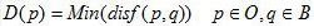
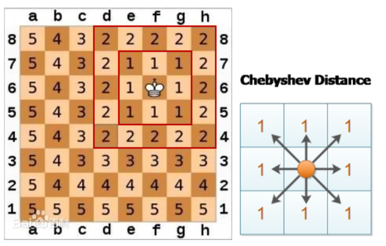
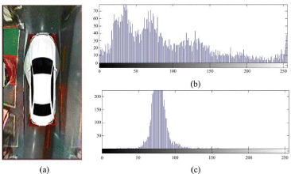

## 1 距离变换

[优秀链接](https://blog.csdn.net/trent1985/article/details/18081761)： 

主要思想是通过表识空间点(目标点与背景点)距离的过程，最终将二值图像转换为灰度图像。边界模糊

假设一幅二值图像I，包含一个连通区域S，其中有目标集O和背景集B，距离图为D，则距离变换的公式:

欧氏距离

曼哈顿距离（街区距离）

契比雪夫距离（棋盘距离）可以理解为国际象棋的王后的走法：

倒角距离（chamfer）：优化二值图像的距离运算速度。

<!-- more -->

 ## 2 边缘图像检测

## 3 直方图处理

## 4 检测库位内是否占据

1. 两条线之间的灰度直方图

2. 距离变换后的边缘图寻找垂直轮廓的直方图