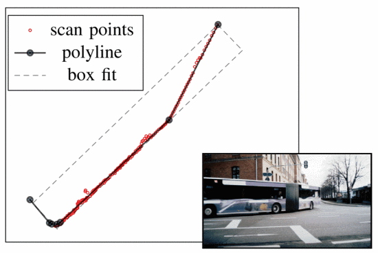
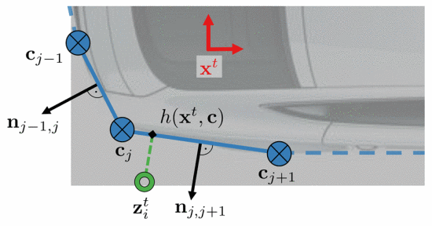
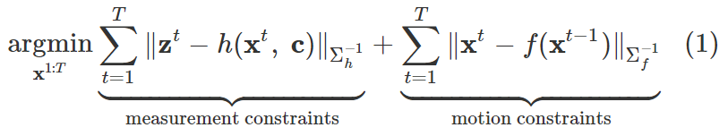
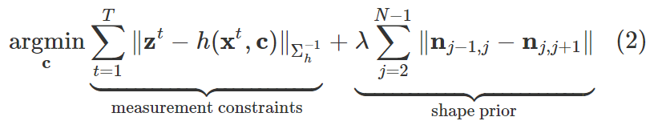
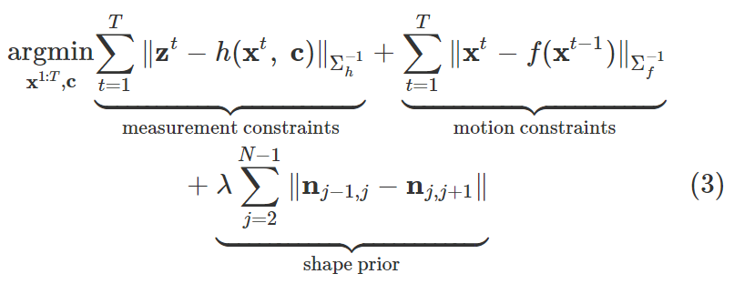
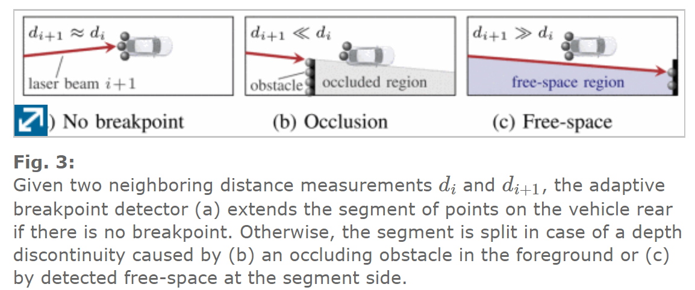
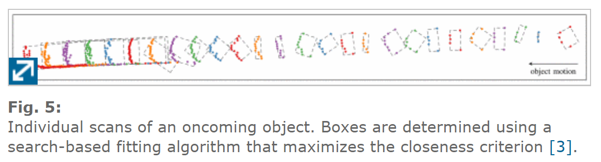
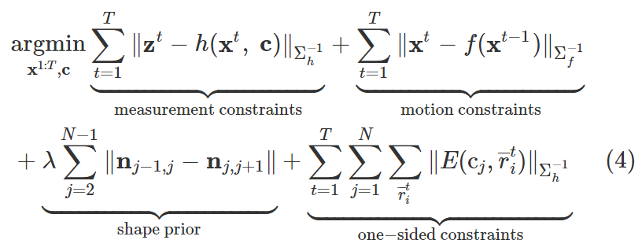

From 《LiDAR-Based Object Tracking and Shape Estimation Using Polylines and Free-Space Information》
[链接](https://ieeexplore.ieee.org/abstract/document/8593385#full-text-header)
# 主要贡献
1. 将**位姿信息估计** 、**多段线拟合的形状估计** 二者结合同时推导跟踪车辆
2. 对激光束点和传感器之间的 **自由空间** 利用起来，改进跟踪器。

<!-- more -->

# 算法流程
## 状态跟踪(X)和形状估计(c)相互优化
   
## laser scan  free-space 未占据的区域检测
  
# 主要结果

# 思考
方法看得不是很明白,他的重心不在怎么拟合,而是通过拟合形状与位姿信息最优化出跟踪信息.对自由空间的利用有空可以看看对泊车有什么启发
