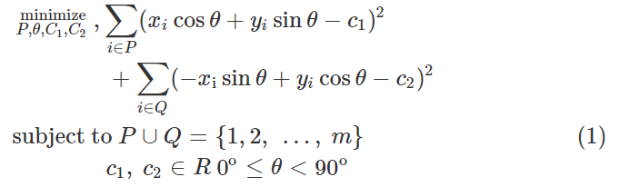
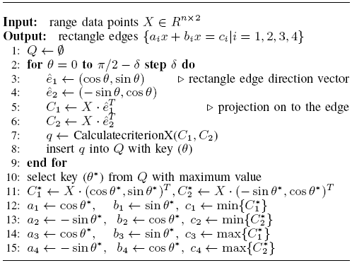
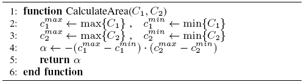
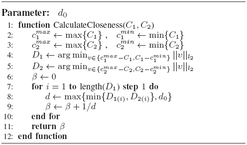
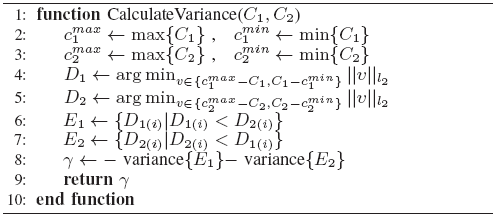
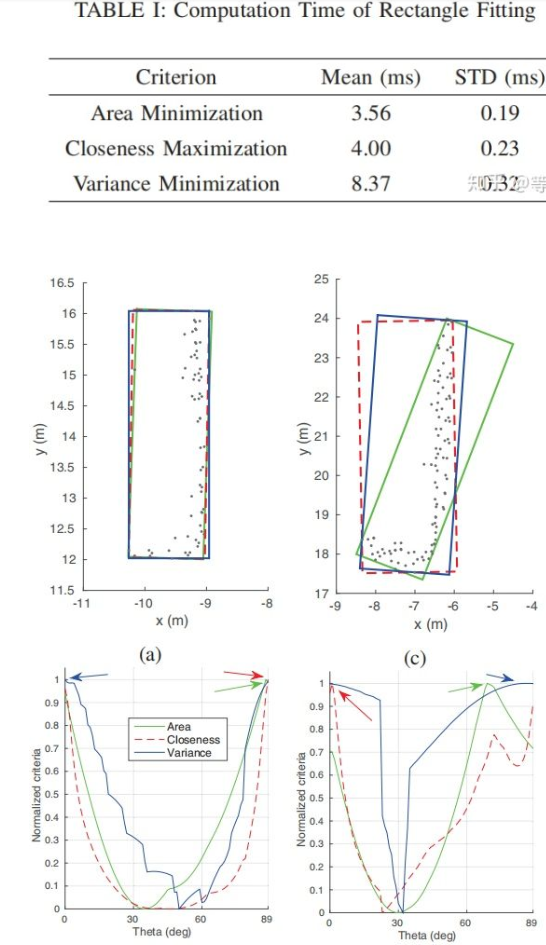
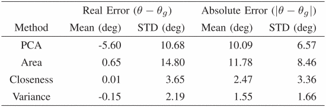
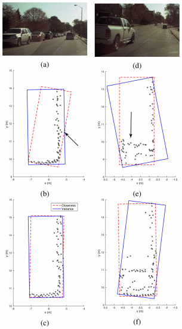

Come from《Efficient L-Shape Fitting for Vehicle Detection Using Laser Scanners》
# 算法
[范文](https://zhuanlan.zhihu.com/p/89011097?utm_source=wechat_session&utm_medium=social&utm_oi=607673551159955456)
## 分割
k-d树搜索组织点云，eucilid聚类，距离阈值是range的函数能够自适应。值得注意的是只使用了点云的xy坐标聚类。
## L-Shape拟合
对于每个簇的拟合结果的性能用最小二乘法进行评估（与拟合优度有何不同？）。注意他这里计算所有点到矩形边的距离，据此将点分为p、q两拨，然后计算所有的平方差之和，作为目标函数。

<!-- more -->

θ是矩形框一条边的方向，按照0~90°空间进行搜索，注意搜索步长step如何设置？寻找到目标函数最小的作为拟合结果。

值得借鉴的是,她利用(sinθ,cosθ)单位向量来表示矩形的边比较方便,相比于用斜率k表示。总体这方法比较熟悉，与王宇辰的一样，只是选择最优的目标函数变化；同时，作者提供了3种各有优劣的判据：**最小面积，最小距离（贴进度），最小平方误差**3种方法，王宇辰采用的是样本到矩形角点距离和最小的判据。分别如下：

Area Criterion
 

Closeness Criterion

求得样本点到4边最小的距离的倒数`d=(min{D1,D2})^-1`作为目标值，设置d0阈值限制分母很小的权重

Variance Criterion

按照样本点距离两边的距离大小分为两拨E1/E2记录下每个点的最小距离，然后求方差之和

# 结果

上面两张图看出来贴进度的判据好像最好

不适用的场景如上,依然会受到后视镜/内部点等干扰影响拟合角度的精度.但是作者认为两种算法互相弥补,并且会在下一时刻得到纠正.

# 总结

文章算法清晰,值得参考的点:
1. 用单位向量和点云在其的投影来表示矩形框及计算其目标函数，方便
2. 多个优化标准相互弥补
3. 衡量拟合结果好坏的标准。
4. **其中按照距离大小把点云分为两拨重新拟合的方法是否值得一试？**

# 摘抄
> Comparing poses among successive cycles also helps to find the target's heading direction.

# 引用文献
> [17]X. Shen, S. Pendleton, M. H. Ang, "Efficient L-shape fitting of laser scanner data for vehicle pose estimation", IEEE Conference on Robotics Automation and Mechatronics, pp. 173-178, 2015.

在文中，利用距离点的排序，即**扫描序列的信息**，有效地将这些点分割成两个互不相交的集合，然后将这两个集合的点分别拟合成两条正交直线，分别对应于小车的两条边;按照扫描序列迭代所有这些二维范围点，该算法搜索一个轴心点，并使用该轴心点生成这两个不相交集，即，在主元之前扫描的点集和在主元之后扫描的点集。
> [16]R. MacLachlan, C. Mertz, "Tracking of moving objects from a moving vehicle using a scanning laser range finder", IEEE Intelligent Transportation Systems Conference, pp. 301-306, 2006.

在[16]中，采用加权最小二乘法去除离群点，将不完整的轮廓拟合到矩形模型中。考虑到遮挡问题，在[16]中**同时进行了线拟合和直角角拟合**，只有当角拟合明显好于线拟合时，才选择角拟合。

# 被引用文献
## 《BoxNet深度学习2DBB》
[BoxNet: A Deep Learning Method for 2D Bounding Box Estimation from Bird's-Eye View Point Cloud，2019](https://ieeexplore.ieee.org/abstract/document/8814058/authors#authors)
### 引用文献
>D. Zermas, I. Izzat, N. Papanikolopoulos, "Fast **segmentation** of 3D point clouds: A paradigm on LiDAR data for autonomous vehicle applications", IEEE International Conference on Robotics and Automation, 2017.

>[15]H. Zhao, Q. Zhang, M. Chiba, R. Shibasaki, J. Cui, H. Zha, "Moving Object Classification using Horizontal Laser Scan Data", IEEE International Conference on Robotics and Automation, 2009.
利用K-L变换提取两个主轴

>**[17]D. Kim, K. Jo, M. Lee, M. Sunwoo, "L-shape model switching-based precise motion tracking of moving vehicles using laser scanners", IEEE Transactions on Intelligent Transportation Systems, vol. 19, no. 2, 2018.**
使用点的有序信息将这些点迭代地聚类为两个正交的线段

### 问题陈述
**来源**: 受到深度学习识别RGB车辆3DBB的启发,识别BEV中点云的2DBB.传统的方法要么需要有序点,要么计算开销大.
**IO**: input|Points(x,y)
        output|[center_x,center_y,width,length,cos(2θ),sin(2θ)]'
### 主要贡献
1. 主要区别在于二维包围盒拟合中不需要估计航向。为了避免-π和π的模糊性,作者使用**the double-angle sinusoidal values**cos(2θ)和sin(2θ)来表示角度,解决了网络学习的不连续性.
2. 预测了点云均值的中心,提高bb位置精度.

### 结果
利用2w个Car类型样本训练
**评估指标**: 中心位置误差,角度误差,Groudtruth 和BB 的重叠比例.

平均误差比较

不足:行人的边界框要小得多，并且长宽比更接近1。因此，BEV点不能表示明确的主轴，并沿着该主轴可以明确定义人的朝向。

IoU重叠部分更好,对扩展目标的原本尺寸估计更好

运行时间大约在7.36ms,下采样到512点

## 《LATTE一个开源点云注释标签的工具》
[github](https://github.com/bernwang/latte)
**思路**：标注人员只需要点一下需要标注的物体附近，算法即刻运行画BB的算法，包括地面去除（平面拟合，奇异值分解求取最佳法向量）、DBSCAN聚类、搜索空间算法（前文）。
**总结**：参考意义不大，但是如果考虑深度学习，这是一个好工具。

## 《L形端点搜索和角点定位，2018 同济》
[An Efficient L-Shape Fitting Method for Vehicle Pose Detection with 2D LiDAR](https://ieeexplore.ieee.org/abstract/document/8665265)
### 主要贡献
>·decomposes the L-Shape fitting problem into two steps: L-Shape vertexes searching and L-Shape corner point locating.
·highly computationally efficient 
·robust enough and able to accommodate various situations.
·does not depend on the laser scanning sequential information

### 算法
#### 聚类
the mean-shift & DBSCAN
#### L形拟合
有一个问题，文中过渡时说基于搜索空间的方法无法访问簇的序列/顺序，但这个算法不需要有序的点啊？
什么玩意，没什么想不到的东西，就字面那么简单！
最后就评估了下时间，matlab-6.2ms，算法不可信。
