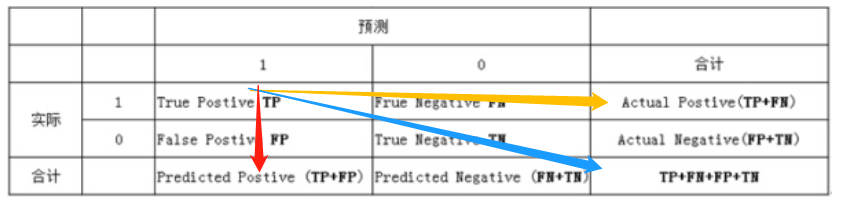

# std::transform

# 准确率，召回率

1为正类，0为负类。

TP为true positive；FN为false negative.

- 准确率(Accuracy)：预测正确的样本/总样本，（TP+TN）/all
- 精确率(precision)：实际为正类样本中，预测正确的比例，TP /（TP+FN）
- 召回率(Recall)：预测为正类样本中，实际正确的比例，TP /（TP+FP）

