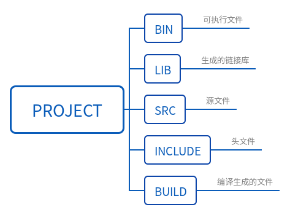

# g++和cmake,make

[学习链接](http://blog.sina.com.cn/s/blog_74a459380102uxlz.html)

任何一个文本程序生成可执行文件的步骤都是:

1. 编辑器编写源代码,.cpp
2. 编译器编译代码生成目标文件,.o文件
3. 链接器链接各个目标文件,生成可执行文件,.exe

由于很多cpp相互关联,一个一个编译就很麻烦,于是出现了利用makefile规则文件自动编译这些cpp. 但是makefile的编写也很麻烦,于是又出现了cmake工具自动编写makefile.

流程如下:

> 源文件-->CmakeLists-->cmake-->makefiles-->make-->.exe可执行文件.

其中gcc和g++在make阶段编译和链接文件,g++在gcc的基础上默认关联了C++库。

# cmake一个helloworld实例

https://www.cnblogs.com/haijian/p/12039160.html



## PCL点云库从入门到精通

由于《PCL点云库从入门到精通》配套代码只有C++语言，不能直接用于ROS平台，遂可先在Ubuntu中编译学习。

  1. 在source文件夹（含有cpp，CMake，pcd）中新建文件夹build：`cd source/;mkdir build/`
  2. 编译source文件夹中的cpp代码：`cd build/; cmake ..`
  3. 生成可执行文件：`make`
  4. 运行可执行文件：`./execute_name

# 指令

[官网教程](https://cmake.org/cmake/help/v3.1/)

 [**ROS：依赖文件和环境**](https://blog.csdn.net/AdamShan/article/details/82901295)
  [**CMakeList详细解读**](https://www.cnblogs.com/Jessica-jie/p/6520481.html)
 视频讲解的更加基础。
 CMakeLists.txt文件是CMake构建系统的输入，在这里我们不会详细讨论CMake的写法（因为它本身可以很复杂），我们大致熟悉一下我们常用的CMake的语法：

`SET(CMAKE_BUILD_TYPE Release)`: 指定编译类型

```shell
set(EXECUTABLE_OUTPUT_PATH ${PROJECT_SOURCE_DIR}/bin) #指定可执行文件生成目录
set(LIBRARY_OUTPUT_PATH ${PROJECT_SOURCE_DIR}/lib)#指定链接文件生成目录
```

`include_directories(${PROJECT_SOURCE_DIR}/include)` : 添加头文件存放的目录

`add_executable(helloworld src/helloworld.cpp src/main.cpp)`:选择要编译的程序文件

`target_link_libraries(myProject a.cpp)`: 将二者链接起来


`cmake_minimum_required：`需要的CMake的最低版本
`project():`包的名称
`find_package()` 查找建构是需要的其他 CMake/Catkin 包
`add_message_files() add_service_files() add_action_files` 生成Message/Service/Action
`generate_messages()` 调用消息生成
`catkin_package()` 指定包的构建信息
`add_library()/add_executable()/target_link_libraries()` 用于构建的库，可执行代码

同样的，在`CMakeList`中，我们通过`find_package`查找这三个包的路径，然后将三个包添加到 `CATKIN_DEPENDS`, 在使用pcl库前，需要将PCL库的路径链接，通过`link_directories( $ {PCL_LIBRARY_DIRS})`来完成，并在最后的`target_link_libraries`中添加`${PCL_LIBRARIES}`。

 `package.xml`的内容很简单，实际上就是这个包的描述文件， `build_depend` 和 `run_depend` 两个描述符分别指定了程序包编译和运行的依赖项，通常是所用到的库文件的名称。 在这里我们指定了三个编译和运行时依赖项，分别是`roscpp`（编写C++ ROS节点），`sensor_msgs`（定义了激光雷达的msg），`pcl_ros`（连接ROS和pcl库）。