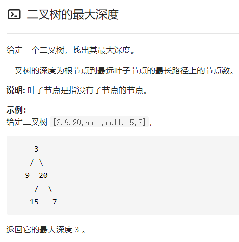
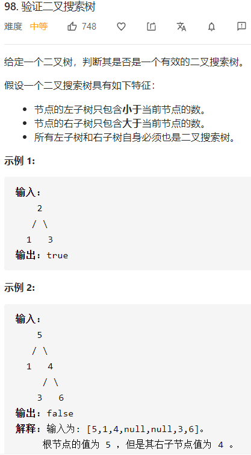

## 二叉树的最大深度

二叉树每个节点都有左右子树，利用递归关系：当前树深度=max(两子树深度最大值）+ 1.

递归初始化：空节点深度为空

## 验证二叉搜索树

左子树的所有节点值都比当前节点小，右节点都比当前节点大。利用limit.h找到树的最大最小值，LONG_MIN, LONG_MAX，设置上下界。左子树为MIN~当前val，右子树为当前val--MAX。

递归关系：若当前节点不在上下界内，返回false；否则，递归验证左右子树，返回他俩的与值。

递归初始化：若当前节点为空，返回true。