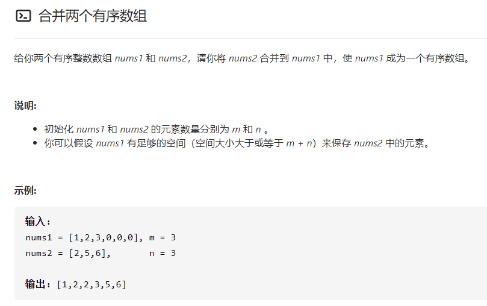
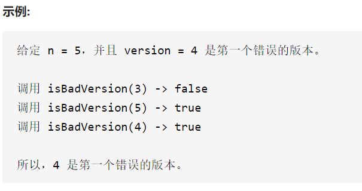

[优秀连接](https://leetcode-cn.com/problems/sort-an-array/solution/python-shi-xian-de-shi-da-jing-dian-pai-xu-suan-fa/)


## 经典排序算法

```C++
#include <iostream>
using namespace std;
int main(){
    int a[8] = {1,56,8,3,5,65,85,43};
    int n =8;
    
    //冒泡排序；
    for(int i= 1;i<=n-1;i++){
        for(int j=0;j<n-i;j++){
            if(a[j]>a[j+1])
                {int temp = a[j];a[j] = a[j+1];a[j+1] = temp;}
        }
    }

    // 选择排序
    for(int i =0;i<n-1;i++){
        for(int j =i+1;j<n;j++){
            if(a[i]>a[j]){
                int temp = a[j];a[j] = a[i];a[i] = temp;
            }
        }
    }

    // 插入排序
    for(int i =1;i<n;i++){
        int temp = a[i];
        int j = i-1;
        while(j>=0 && temp < a[j]){
            a[j+1] = a[j];
            j--;
        }
        a[j+1] = temp;
    }

    for(int k =0;k<n;k++)
        cout<<a[k]<<" ";
    return 0;
}
```


### 合并两个有序数组



双指针。copy一个nums1内存空间res保存结果。

p<q, 则p值放入res，p++;反之同。退出循环的条件，指针没到末尾

注意：p,q长度不一致，把未排完的依次放入res末尾。

### 第一个错误版本



二分法查找。复杂度o(logn)

初始化边界：left为1，right为n. 

判断中间值：isBadVersion(left+(right-left)/2)

退出循环的条件： left < right