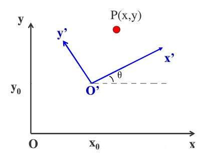

库函数主要学习链接: http://zhaoxuhui.top/blog/2019/08/21/eigen-note-4.html

官方:https://eigen.tuxfamily.org/dox/classEigen_1_1Transform.html

理论学习 古月居：https://www.guyuehome.com/4463 比较清晰

# 旋转平移

[学习blog链接](http://zhaoxuhui.top/blog/2019/09/03/eigen-note-4.html#23d%E6%97%8B%E8%BD%AC)

`#include <Eigen/Gometry>`

## 2D旋转

**Rotation2D**类, 构造参数可以输入

- 旋转角度, *注意：顺时针为正,逆时针为负值.*
- 2*2旋转矩阵, 
- 另一个Rotation2D类.  

成员函数:

- `.cast()`, 可以将Rotation2Df对象与Rotation2Dd对象类型相互转换
- `.angle()`, 返回旋转角
- `.matrix()`, 返回旋转矩阵
- `.toRotationMatrix()`, 将当前Rotation2D对象转变为2*2矩阵
- `.fromRotationMatrix()`, 输入矩阵, 构建Rotation2D对象.
- `.inverse()`, 相反方向旋转

## 平移

**Translation**类，可调用

```C++
Translation<float,2>(tx, ty);
Trasnlation2f t(1.0,2.0);
```

- `.x()`: 获取平移的x分量
- `.vector()  &  .translation()`: 获取平移向量，可用[]索引
- `.inverse()`: 逆方向平移

## 3D 旋转 

### 角轴

**AngleAxis**类，可调用AngleAxisf

```C++
AngleAxisd theta(45/180*M_PI, Vector3d::UnitZ());
// 第一个输入角度，第二个输入参数进行归一化
```


# Transform变换


空间变换的详细概念参见文章开始的链接学习比较清晰。[secret Land](http://zhaoxuhui.top/blog/2019/09/03/eigen-note-4.html#1%E7%AD%89%E8%B7%9D%E5%8F%98%E6%8D%A2)

常见的包括等距变换(Isometry)、仿射变换(Affine)、射影变换(Prospective)等Eigen已经预定义好了相关类，下面进行介绍。其中欧式变换又称等距变换，刚体变换，它不会改变变换对象的自身属性。

> 等距变换(Isometry Transform)可以看作是维持任意两点距离不变的仿射变换，也称做欧氏变换、刚体运动，在实际场景中使用比较多。

因此我们俯视图中的坐标系变换可以考虑使用isometry

## Isometry

在Eigen中已经内置好了一些常用的等距变换可以直接调用，

```C++
/** \ingroup Geometry_Module */
typedef Transform<float,2,Isometry> Isometry2f;
/** \ingroup Geometry_Module */
typedef Transform<float,3,Isometry> Isometry3f;
/** \ingroup Geometry_Module */
typedef Transform<double,2,Isometry> Isometry2d;
/** \ingroup Geometry_Module */
typedef Transform<double,3,Isometry> Isometry3d;
```

构造方法:

```C++
	Vector2f tr(1,1);
    Isometry2f T = Isometry2f::Identity();
    T.translate(tr);
    T.rotate(1.2*3.1415926/4);

    cout<<"T.matrix\n"<<T.matrix()<<endl;
    cout<<"T.rotation\n"<<T.rotation()<<endl;
    cout<<"T.translate:\n"<<T.translation()<<endl;
    Vector3f state_X = {0,0,1};
    cout<<"result:\n "<<T.matrix()*state_X<<endl;
```

该库函数2D平移旋转的思路是：



该代码中，我们现在要将O'坐标系变换到新的坐标系O（即点不动，求取P点在新坐标系下的坐标）：先将O'平移到O，再旋转O'坐标轴与O重合。

**平移向量`tr`**的取值是在*世界坐标系下*平移的量，正负号与世界坐标系一致，即向负半轴移动平移量为正。（原因，我改变旋转的角度rotate后，不改变tr值，输出结果不变，所以可以看出平移量并不是O在O'下的坐标），并不是通常的坐标变换过程中待求坐标系O原点在O‘坐标系下的坐标的负方向。因此我们没有定义世界坐标系时并不能使用。

**旋转向量**，坐标轴顺时针转为正。*区别于坐标点的转移符号，坐标系的顺时针旋转即相当于点的逆时针旋转，所以这里顺时针旋转为负*

