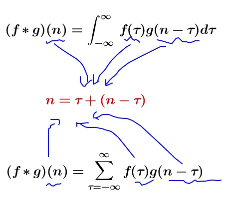
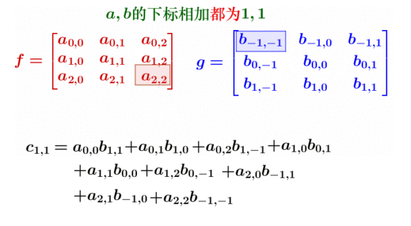
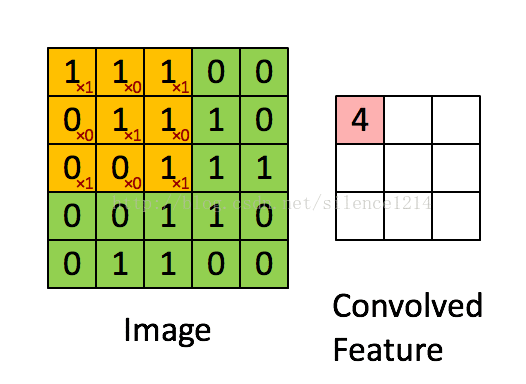
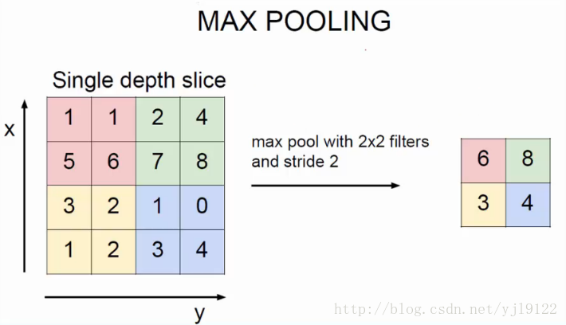

# 准确率，召回率

1为正类，0为负类。

TP为true positive；FN为false negative.

- 准确率(Accuracy)：预测正确的样本/总样本，（TP+TN）/all
- 精确率(precision)：实际为正类样本中，预测正确的比例，TP /（TP+FN）
- 召回率(Recall)：预测为正类样本中，实际正确的比例，TP /（TP+FP）

# 回归和分类

回归：对数值型连续随机变量的进行预测并建模的监督学习方法，例如股价走势，成绩变化。

分类：对离散型随机变量进行分析建模预测的监督学习方法，如图像识别，邮件过滤。

# 什么是卷积层，池化层

## 卷积

数学上卷积的定义：

具体的案例可以思考，两颗骰子的点数和为4的概率？而在图像识别领域，称图像内核filter与图像的滑动运算为“卷积”，在于二者运算时下标和为1，与卷积公式一致：

 											

传统的图像处理是对单个像素处理，失去了事物的连续性特征。而采用卷积的操作，对一片多个像素同时处理。这样更能理解卷积。

**卷积层**：这一层指代上述的用filter与图像滑动运算的操作，以获取不同filter运算得到的不同特征图输入网络学习。

## 图像内核，filter

有趣的互动链接：https://setosa.io/ev/image-kernels/

## 激活函数

上诉的卷积操作都是线性运算，不足以模拟非线性的过程，因此对每个神经元进行激活函数的操作，使得更加复杂。

常见的激活函数：

- tanh,sigmoid函数f(x) = 1/(1+exp(x))
- ReLU函数使用更广泛：f(x)=max{0,x}

## 池化层

简单理解一下就是对特征图进行压缩降低维度的操作。其滑动的步长和窗口的尺寸一样，因此不会重叠，与卷积有差别。主要目的是将特征突出，将非特征变得更暗淡。